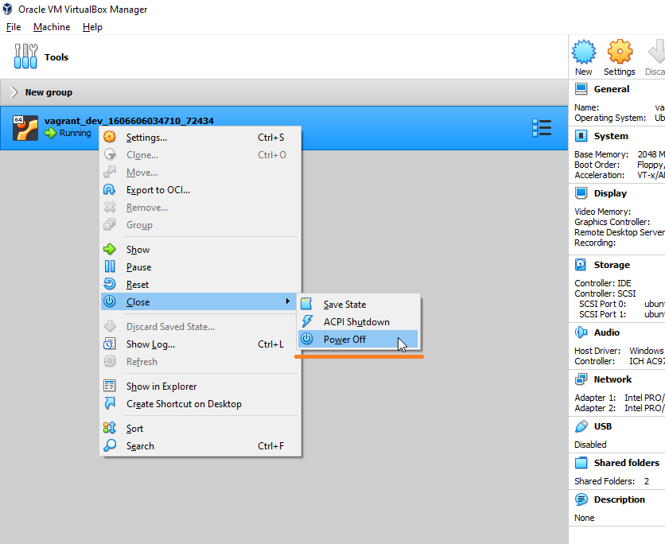
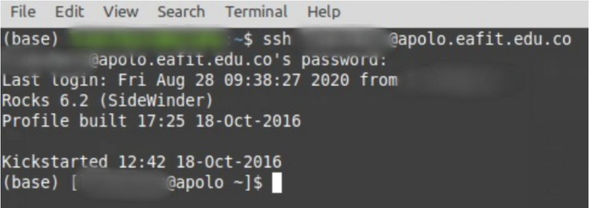

.. _configure_vpn:

Windows and Mac OSX
-------------------
To configure the VPN on Windows and Mac OS X systems, you must follow exactly the same procedure. Here are the steps to
download and configure the VPN client:

#. Open your favorite browser and go to https://leto.omega.eafit.edu.co and log in with your **username** and **password** given by EAFIT or Apolo's staff

    .. image:: images/GP1_Login.png
        :align: center
        :alt: Open your browser

#. Download and install the version of Global Protect client according to your operating system

    .. image:: images/GP2_Download.png
        :align: center
        :alt: Download the proper version

#. Install the Global Protect application

    .. image:: images/vpnwin/vpnwin3.png
        :align: center
        :alt: Install app

#. Choose where to install it, take into account your permissions on the system

    .. image:: images/vpnwin/vpnwin4.png
        :align: center
        :alt: Install app

#. Finish installation

    .. image:: images/vpnwin/vpnwin5.png
        :align: center
        :alt: Install app

#. Close installation

    .. image:: images/8-globalprotect-install.PNG
        :align: center
        :alt: Close Install app

#. Launch the Global Protect application and fill the portal input **Portal** with *leto.omega.eafit.edu.co*

    .. image:: images/GP3_Portal.png
        :align: center
        :alt: Configuration of the application

#. Fill the fields with the following information:

    .. image:: images/GP4_Login.png
        :align: center
        :alt: Fill the fields

    - **Username:** The username assigned by the Apolo's system administrator.
    - **Password:** The password used to log in to the clusters.

    .. warning::
        The password sent to your email is one-time password, the first time you login
        to our clusters the system will ask you for changing the password, after that the
        new password will be used to log in to the VPN.

    .. warning::
        Remember your password will expire every three (3) months.

#. Once connected to the VPN, go to the Taskbar as you see in the image

    .. image:: images/vpnwin/vpnwin9.png
        :align: center
        :alt: Connected Taskbar

#. You will see the word Connected as shown in the image

    .. image:: images/GP5_Connected.png
        :align: center
        :alt: Connected!

#. You can see some network parameter in the Details tab, go to the menu and click on Configuration

    .. image:: images/vpnwin/vpnwin11.png
        :align: center
        :alt: Details

#. See the network parameters

    .. image:: images/GP6_Configuration.png
        :align: center
        :alt: Details

.. warning::
    You must login for the next 5 hours or the account will be deactivated.

Using Vagrant to set up a VirtualMachine
^^^^^^^^^^^^^^^^^^^^^^^^^^^^^^^^^^^^^^^^
If for any reason you can't connect on Mac or Windows using the "Global Protect" application, you can use vagrant to set up a linux virtual machine and connect to the Apolo network through it.

.. note::

   This is something to use as last resource, it may make things a little complex. We highly recommend to use the "Global Protect" application and contact the Apolo staff for any doubts or problems but they might be a situation where the application has problem with a specific version of Windows or Mac and we'll recommend you to use this method.

Explaining each tool is out of the scope of this guide. We are going to show a step by step on how to install and use each of the tool to connect to the Apolo network. For more information we recommend to look at the apropiated doc of each tool:

* https://www.vagrantup.com/docs

* https://www.virtualbox.org/wiki/Documentation

#. Open your favorite browser, go to https://www.virtualbox.org/wiki/Downloads and download the package appropiated to your platform.

#. Open your favorite browser, go to https://www.vagrantup.com/downloads.html and download the package appropiated to your platform.

#. After installing both applications, copy and paste the following text on a file with the name *Vagrantfile* and save it to any directory, for the rest of the guide we're going to suppose the *Vagrantfile* was stored at the Desktop.

        .. code-block:: bash

            # -*- mode: ruby -*-
            # vi: set ft=ruby :
            Vagrant.configure("2") do |config|
              # boxes at https://vagrantcloud.com/search.
              config.vm.box = "ubuntu/focal"

              config.vm.provision "shell", inline: <<-SHELL
                apt-get update
                apt-get install -y vpnc openssh
              SHELL
            end

#. Also copy the file with the extension **.pcf** given to you by the Apolo staff to the same directory where the **Vagrantfile** is.

        .. note::
            If you don't have any file with that extension please write to the staff asking for the file needed on linux to connect to the VPN. You'll need it in the next steps.

#. Then you need to open the terminal and navigate to the desktop directory. On Windows you can open the terminal pressing the *Windows Key* + *R* then typing *cmd.exe* and clicking *OK*.

        .. image:: images/vagrant/01.png

#. While being on the same directory where the Vagrantfile is, start the virtual machine.

        .. code-block:: bash

            $ vagrant up

        .. note::

           If you are running MacOS and this command failed please check the *Security & Privacy* panel on *System Preference* and allow the *System software from Oracle America was blocked from loading*
           More info at https://appuals.com/virtualbox-the-installation-failed-on-mac/

#. Then connect to the virtual machine.

        .. code-block:: bash

            $ vagrant ssh

#. Now that you are connected to the virtual machine follow the steps on the _`Connect through the terminal` section.

        .. note::
           You can access the same directory where you *Vagrantfile* is within the virtual machine at the path */vagrant*.

To turn off the virtual machine, you can do it from the terminal with.

.. code-block:: bash

   $ vagrant halt

Or through the *VirtualBox GUI*.

Linux
-----
.. note::
    Depending on your distribution this procedure could change.

To configure the VPN on Linux, you have to use your package manager to install a Cisco Compatible VPN client. The most
common client is vpnc, which is embedded on a set of scripts. Usually, the package with these scripts is called :code:`vpnc`.

Connect through a GUI
^^^^^^^^^^^^^^^^^^^^^^^^

If you use Gnome or a Gnome compatible window manager you should install the :code:`network-manager-vpnc-gnome` and :code:`vpnc` packages. If you use KDE or a KDE compatible window manager you'll need to install the :code:`plasma-nm` and :code:`vpnc` packages instead.

.. code-block:: bash
    :emphasize-lines: 9,10,12,13
    :caption: **Tested on Ubuntu 18.04 and 20.04**

    $ sudo apt search vpnc
    [sudo] password for user:
    kvpnc/bionic 0.9.6a-4build1 amd64
    frontend to VPN clients

    kvpnc-dbg/bionic 0.9.6a-4build1 amd64
    frontend to VPN clients - debugging symbols

    network-manager-vpnc/bionic-updates,bionic-security,now 1.2.4-6ubuntu0.1 amd64
    network management framework (VPNC plugin core)

    network-manager-vpnc-gnome/bionic-updates,bionic-security,now 1.2.4-6ubuntu0.1 amd64
    network management framework (VPNC plugin GNOME GUI)

    vpnc/bionic,now 0.5.3r550-3 amd64
    Cisco-compatible VPN client

    vpnc-scripts/bionic,bionic,now 0.1~git20171005-1 all
    Network configuration scripts for VPNC and OpenConnect

.. code-block:: bash

    $ sudo apt install vpnc network-manager-vpnc-gnome

Once the correct package is installed according to your distribution, you can proceed to configure the VPN client.

.. warning::

    It is strongly recommended to log out and log in before to start the following steps because there are some cases where the VPN connection does not
    work until log out or reboot is performed after the package installation.

.. warning::

    The following procedure may vary depending on the package installed. We are going to use the configuration for network-manager-vpnc-gnome
    due this is the most common package on usual Linux distributions.

#. Open the main menu and System Settings.

    .. image:: images/vpnlin/menu.png
        :align: center
        :alt: System Settings

#. Look for Network item and click on the plus symbol to add a new connection.

    .. image:: images/Linux1_Config.png
        :align: center
        :alt: Add a new connection

#. Choose Import from file...

    .. note:: The VPN file will be provided by the system administrator, please request it before to continue with this guide.

    .. image:: images/Linux2_Import.png
        :align: center
        :alt: Add a new connection

#. Once the file has been imported you just need to add your username and password provided by the administrator. **Note that
   the group password is filled automatically by the imported file**.

    .. image:: images/Linux3_ConfigVPN.png
        :align: center
        :alt: Fill the fields

#. On IPv4 options on the left panel, please add the following route and apply the configuration.

    .. image:: images/Linux4_IPv4.png
        :align: center
        :alt: Advanced configuration

#. Now you can connect to the cluster through the VPN.

    .. image:: images/Linux5_ActivateVPN.png
        :align: center
        :alt: Connected

#. Once you are connected to the VPN, access Apolo via SSH with the following command and type your password:

.. code-block:: bash

   $ ssh <username>@apolo.eafit.edu.co

.. note::
    Remember that the first time it will be necessary to change the password assigned by a new one that must contain a combination of lower case, upper case, numbers and special characters. It must have a minimum of 8 characters.

Connect through the terminal
^^^^^^^^^^^^^^^^^^^^^^^^^^^^
.. note::
     Depending on your distribution some extra packages might be needed.

To be able to connect to the VPN through the terminal, the :code:`vpnc` package is needed.

.. code-block:: bash
    :emphasize-lines: 9,10
    :caption: **Tested on Ubuntu 20.04**

    $ sudo apt search vpnc

    network-manager-vpnc/focal,now 1.2.6-2 amd64 [installed,automatic]
      network management framework (VPNC plugin core)

    network-manager-vpnc-gnome/focal,now 1.2.6-2 amd64 [installed]
      network management framework (VPNC plugin GNOME GUI)

    vpnc/focal,now 0.5.3r550-3.1 amd64 [installed]
      Cisco-compatible VPN client

    vpnc-scripts/focal,focal,now 0.1~git20190117-1 all [installed,automatic]
      Network configuration scripts for VPNC and OpenConnect

.. code-block:: bash

    $ sudo apt install vpnc

After installing the package, you'll need to convert the .pcf file to a .conf file.

.. code-block:: bash

   $ pcf2vpnc ./Apolo-vpn-file.pcf Apolo-vpn-file.conf

Once you have the .conf file, you'll need to change the following line

.. code-block:: bash

    Xauth username jdpinedac

And replace 'jdpinedac' for the username given to you by the Apolo staff. After that, you can initiate the VPN connection using the vpnc program.

.. code-block:: bash

   $ sudo vpnc ./Apolo-vpn-file.conf
   Enter password for username@leto.omega.eafit.edu.co:

If the given password was correct It'll start the VPN service on the background.

To stop the VPN, just run:

.. code-block:: bash

   $ sudo vpnc-disconnect
   Terminating vpnc daemon (pid: 171941)

Once you are connected to the VPN, access Apolo via SSH with the following command and type your password:

.. code-block:: bash

   $ ssh <username>@apolo.eafit.edu.co

.. note::
    Remember that the first time it will be necessary to change the password assigned by a new one that must contain a combination of lower case, upper case, numbers and special characters. It must have a minimum of 8 characters.

Troubleshooting
---------------
.. seealso::
    You can find a Global Protect example for windows or mac configuration on the following screencast:

        .. raw:: html

            <iframe align="middle" width="560" height="315" src="https://www.youtube.com/embed/C7LXgZ3hCsQ" frameborder="0" allow="autoplay; encrypted-media" allowfullscreen></iframe>

.. seealso::
    **Issue:** After installing or upgrading the Mac GlobalProtect client, the client never connects and just "spins".

    **Solution:**

    1. Click the Apple icon in the upper left hand corner, then click 'System Preferences', then 'Security'.

    2. Look for a message at the bottom of the window stating "System software from developer was blocked from loading."

    3. To allow the software to load again, click the Allow button.

    If that doesn't work, try the following: https://docs.paloaltonetworks.com/globalprotect/4-0/globalprotect-agent-user-guide/globalprotect-agent-for-mac/remove-the-globalprotect-enforcer-kernel-extension

.. seealso::
    Sometimes, When you close the mac with the VPN open, there may be problems in re-establishing the connection to the VPN, so it is suggested that you close the program and reopen it.
