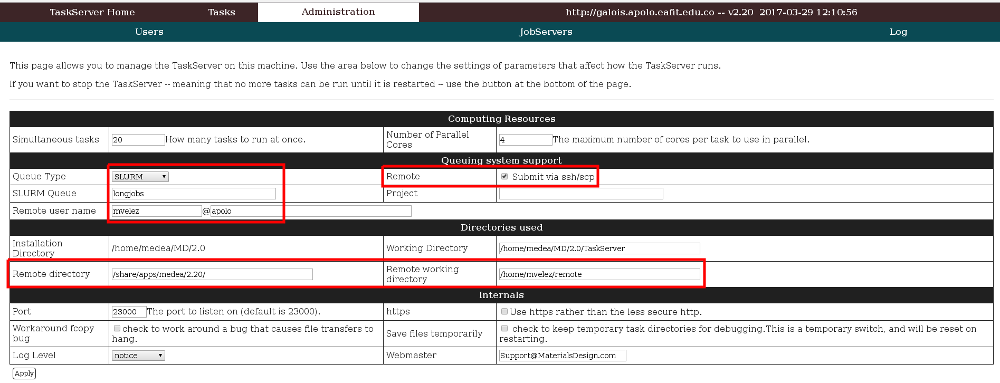

.. _medea-2.20.4:

******
2.20.4
******

.. contents:: Table of contents

- **Installation date:** 7/04/2017
- **URL:** http://www.materialsdesign.com/medea
- **Apolo version:** Apolo II
- **License:** Commercial (Payment)

Requirements
----------------

- mysql-client >= 5.1
- mysql-server >= 5.1
- libXScrnSaver
- User previously created in Apollo (i.e. mvelez)
- SSH without password between the machine that has the MedeA and Apollo GUI.

Steps:

- Packages

.. code-block:: bash

    yum install glibc.i686 libstdc++i686 libX11.i686 libXft.i686 zlib.i686
    yum install mysql-server mysql-client

- SSH without password

.. code-block:: bash

    ssh-keygen
    ssh-copy-id mvelez@apolo.eafit.edu.co

