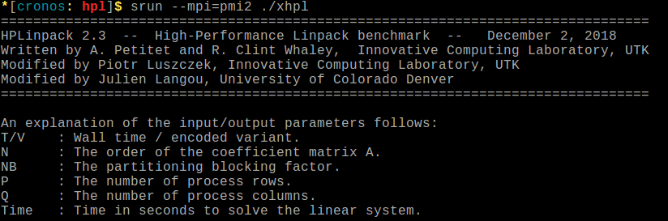

.. _testing-slurm:

.. role:: bash(code)
          :language: bash

.. role:: raw-html(raw)
          :format: html

**Testing my job**
==================

Here you will find some interesting ways to test your jobs before submitting it
to compute a real problem with a big Walltime. It is always a good idea to use
some of these tips in order to prevent the failure of your jobs.

.. contents:: Contents
              :local:

Debug partition
---------------
The debug partition is a useful queue created to test your Slurm job script,
it does not have any performance capabilities but its nodes have the same
environment as the longjobs partition.

To use this partition you only need to specify it in your batch script like
this:

.. code-block:: bash

   #!/bin/bash
   #SBATCH --partition=debug
   # Other sbatch parameters

.. note::
  Quick aspects about the debug partition:

  * **Apolo:**
      * Number of Nodes: 2
      * Number of CPUs per node: 2
      * Memory per node: 2GB
  * **Cronos:** Not deployed yet.

  For more information, see :ref:`getting cluster information <info-jobs>` section

.. warning::
  Debug partition has the same environment of longjobs, so if you want to test
  a job that will be executed in a different queue (e.g Accel or Bigmem)
  it does not guarantee a successful execution.

``salloc`` command
-------------------
This command is used to allocate resources (e.g Nodes, tasks, mem, etc.)
and, if available, interactively run jobs steps under that allocation using
a sub-shell created by Slurm [1]_ .

This sub-shell will let you write those commands that you use to execute your
application on the allocated **compute node(s)** of your job, as they were executed
on a sbatch script. Thus, every command will give you immediate feedback of its
``std_out``, ``std_err`` and ``EXIT_CODE`` in your terminal. We recommend
following these parts: **Environment creation** and **Job(s) steps**.
See :ref:`submit` to know more information.

This example shows the submission of HPL_, a well-known implementation of
the High Performance Computing Linpack Benchmark, it uses ``MPI``.

Following the same parts showed in the :ref:`submit` we will have:

* **Environment creation**: We need to load two modules: ``impi`` and ``mkl``
* **Job step**: HPL uses one job-step, the execution of ``xhpl``

In this case, we executed HPL_ using  ``16`` processes (``--ntaks=16`` in Slurm).
You need to specify the **Walltime**, it refers to the time that the sub-shell
will be alive.

First, we ran ``salloc`` specifying the number of processes and the period of time,
allocating the resources and, if available, it will create a sub-shell.

.. image:: src/testing/images/hpl1.png

Next, we ran the commands to create the environment

.. image:: src/testing/images/hpl2.png

Then we executed the job-step. You can notice the `std_out` was immediately
written on the terminal

.. warning::
   If you are using ``salloc``, the use of ``srun`` in every **job-step** is mandatory.
   It does not matter the type of job you are computing (even a Serial or OpenMP job).
   This is because, compared with the jobs submitted using sbatch, salloc's jobs
   does not have a ``BatchHost`` by default, so all the commands are executed in the
   **master node**, instead of one of the allocated compute nodes. You need to
   use ``srun`` to **explicitly** run that command in the allocated node(s)

   This example illustrates the problem of **not** using ``srun`` in a job-step

   .. image:: src/testing/images/hostname_salloc1.png

   and using ``srun``, then:

   .. image:: src/testing/images/hostname_salloc2.png

``--test-only`` parameter
-------------------------
This parameter will validate the batch script and return an estimate of when the
job would be scheduled to run [2]_, given the current state of the queue and
other arguments specified (e.g ``Nodes``, ``tasks``, ``cores``) on the job
requirements. **THE JOB is NOT actually submitted**.

As an example, we use this sbatch script, as you can notice, we add the line
``#SBATCH --test-only``

.. literalinclude:: src/testing/test-only.sh
       :language: bash

**output**:

.. image:: src/testing/images/test-only.png

References
----------

.. [1] SchedMD LLC (2018). Slurm, resource management [salloc]. Copy of manual text available at
       https://slurm.schedmd.com/salloc.html. Retrieved 18:11 February 11, 2019

.. [2] SchedMD LLC (2018). Slurm, resource management [sbatch]. Copy of manual text available at
       https://slurm.schedmd.com/sbatch.html. Retrieved 17:20 January 30, 2019

.. _HPL: http://www.netlib.org/benchmark/hpl/
