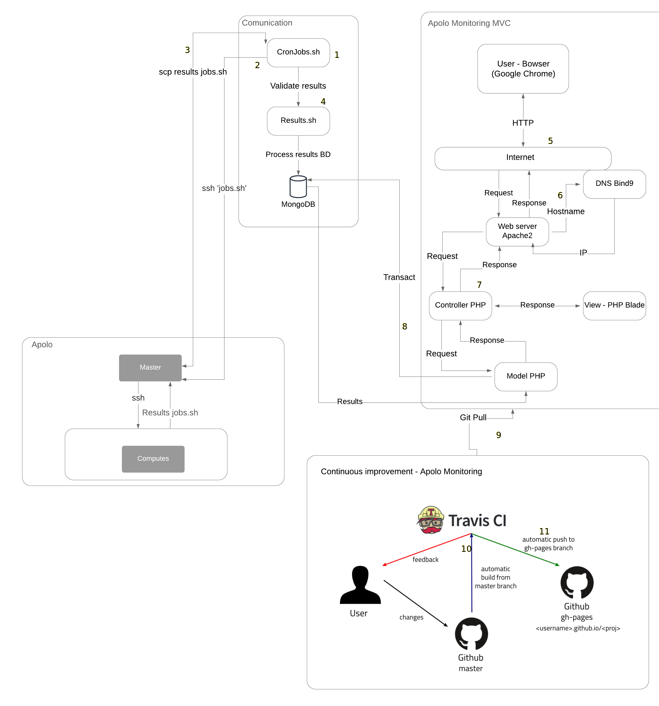

.. _monitoring_apolomonitoring-index:

Apolo Monitoring
****************

Apolo monitoring is a web application designed to monitor the different resources consumed by the jobs running in the Apolo cluster. The resources monitored by the web application are the following: Percentage of cores availability per node, amount of RAM consumed and amount of SWP memories consumed. It also has a log of jobs in execution with their respective information, it has sections of history of percentage of utilization updated every 24 hours, percentage of utilization updated every hour. Apolo monitoring is structured to add new functionalities.

.. contents::

Basic information and dependencies
==================================

- **Deploy date:** 05th May, 2021
- **Tested in:** Apolo test environment
- **Installed in:** Apolo II
- **Programming language:** PHP 7.4
- **Composer:** Composer 2.0.12
- **Framework:** Laravel 5.8
- **Data Base:** Mongo DB
- **Web server:** Apache2
- **DNS server:** Bind9
- **Continuous improvement and deployment:** Travis CI
- **External files:** Scripts sh

¿What is PHP?
=============

PHP (recursive acronym for PHP: Hypertext Preprocessor) is a very popular open source language especially suitable for web development and can be embedded in HTML.

PHP 7.4 Installation and its dependencies
=========================================

Steps to install php 7.4

.. code-block:: bash

	sudo apt update

	sudo apt install apache2

	sudo systemctl start apache2.service

	sudo systemctl enable apache2.service

	sudo apt-get install software-properties-common

	sudo add-apt-repository ppa:ondrej/php

	sudo apt update

	sudo apt-get install php7.4 libapache2-mod-php7.4 php7.4-cli php7.4-mysql php7.4-gd php7.4-imagick php7.4-recode php7.4-tidy php7.4-xmlrpc

	php -v

¿What is Composer?
==================

Composer is a package manager for PHP that provides a standard for managing, downloading and installing dependencies and libraries. Similar to NPM in Node.js and Bundler in Ruby, Composer is the ideal solution when working on complex projects that rely on multiple installation sources. Instead of having to download each dependency manually, Composer does this automatically for us.

Composer installation
=====================

#. Installation of dependencies

It will install the dependencies. We will need curl to download Composer and php-cli to install and run it. The php-mbstring package is needed to provide functions for a library we will use. Composer uses git to download project dependencies and unzip to extract compressed packages. It is possible to install everything with the following command:

.. code-block:: bash

	sudo apt update

	sudo apt install curl php-cli php-mbstring git unzip

2. Downloading and installing Composer

Composer provides an installer written in PHP. We will download it, check that it is not corrupted and use it to install Composer.

.. code-block:: bash

	cd ~

	curl -sS https://getcomposer.org/installer -o composer-setup.php

Next, verify that the installer matches the SHA-384 hash for the most recent installer found on the Composer Public Keys/Signatures page. Copy the hash from that page and store it as a shell variable:

.. code-block:: bash

	HASH=544e09ee996cdf60ece3804abc52599c22b1f40f4323403c44d44fdfdd586475ca9813a858088ffbc1f233e9b180f061

Now, run the following PHP script to verify that the installation script runs safely:

.. code-block:: bash

	php -r "if (hash_file('SHA384', 'composer-setup.php') === '$HASH') { echo 'Installer verified'; } else { echo 'Installer corrupt'; unlink('composer-setup.php'); } echo PHP_EOL;"

You will see the following result:

.. code-block:: bash

	Installer verified

.. warning::

	If you see the Installer corrupt message, you will need to double-check if you used the correct hash and re-download the installation script. Then run the command to verify the installer again. Once you have a verified installer, you can continue.

3. To install composer globally, use the following command which will download and install it system-wide as a command named composer, in /usr/local/bin:

.. code-block:: bash

	sudo php composer-setup.php --install-dir=/usr/local/bin --filename=composer

To check your installation, run the following:

.. code-block:: bash

	composer

You will see that the Composer version and arguments are displayed in this output.

.. code-block:: bash

	Output
	   ______
	  / ____/___  ____ ___  ____  ____  ________  _____
	 / /   / __ \/ __ `__ \/ __ \/ __ \/ ___/ _ \/ ___/
	/ /___/ /_/ / / / / / / /_/ / /_/ (__  )  __/ /
	\____/\____/_/ /_/ /_/ .___/\____/____/\___/_/
	                    /_/
	Composer version 2.0.12 2021-03-03 11:44:59

	Usage:
	  command [options] [arguments]

	Options:
	  -h, --help                     Display this help message
	  -q, --quiet                    Do not output any message
	  -V, --version                  Display this application version
	      --ansi                     Force ANSI output
	      --no-ansi                  Disable ANSI output
	  -n, --no-interaction           Do not ask any interactive question
	      --profile                  Display timing and memory usage information
	      --no-plugins               Whether to disable plugins.
	  -d, --working-dir=WORKING-DIR  If specified, use the given directory as working directory.
	  -v|vv|vvv, --verbose           Increase the verbosity of messages: 1 for normal output, 2 for more verbose output and 3 for debug
	. . .

¿What is Laravel?
=================

Laravel is one of the easiest to assimilate open source frameworks for PHP. It is simple, very powerful and has an elegant and fun to use interface.

Create a laravel project
========================

.. code-block:: bash

	composer create-project laravel/laravel="5.8.*" NameProject

To start a Laravel project locally we execute:
==============================================

.. code-block:: bash

	cd NameProject

	php artisan serve

¿What are migrations in Laravel?
================================

In Laravel, it is said that migrations are a version control of our database, but in reality they are more than that. It allows us to create tables, establish relationships, modify them and of course delete them, and all this through the command console.

Creating a migration
====================

First we will have to open the console or command line and position ourselves in the path of our project. After that, execute the following command to create our first migration.

.. code-block:: bash

	php artisan make:migration create_users_table

¿What are controllers in laravel?
=================================

Controllers are a mechanism that allows us to group related HTTP request logic and thus better organize our code.

Generate a controller
=====================

We generate a new controller with the Artisan command make:controller passing it the name we want to give it. In the example the name is UserController:

.. code-block:: bash

	php artisan make:controller UserController

¿What is travis-CI?
===================

Travis-CI is a Continuous Integration system, free for Open Source projects and paid for private projects. It integrates seamlessly with GitHub and automatically executes the pipeline defined in each push or pull request. It tests and builds applications written in Ruby, Node, Objective-C, Go, Java, C#, F# and PHP, among others (running on Linux).

Steps to follow to use Travis-CI
================================

#. The first step is to create a GitHub repository containing the code of the application we want to incorporate into Travis-CI.
#. Once the repository is created, we must give permissions to Travis to connect to it. To do this we must go to the repository settings, click on "Services" and select Travis-CI. Once there select "Add to GitHub".

2. After this, on the next page we must grant all required permissions to Travis-CI.

3. Once in Travis-CI, select the "+", find the repository you want to work on and click on the switch.

4. Go back to the GitHub repository and create the .travis.yml file. This file should be hosted in the root of the project. It will tell Travis-CI what to do every time it runs a Build.

5. If the Build is satisfactory, Travis-CI will display the results in green, otherwise the results will be red.

Technology diagram of Apolo Monitoring
======================================

#. First we have the communication, which is the basis for the whole system built, here we have the cron table where several srcipts.sh are executed at certain times.

#. When any of the scripts in the cron table is executed, it connects to the Apolo master through SSH to execute scripts that are specifically programmed to obtain information such as: cluster utilization percentage, RAM memory consumed, SWP memory consumed, core availability percentage and running jobs information.

#. Once the information is ready in the Apolo master, another cron is executed to SCP the application home with the information generated in the previous step.

#. At the end of the SCP, another cron is run to review the downloaded data and then inject the information into the database.

#. When an Apolo administrator wants to use the web application, he/she will have to search from a web browser (Google Chrome), hostname to be able to use it.

#. When looking up the web application in the browser, the Internet will communicate with the web server, then the web server will communicate with the DNS server to resolve the name of the web application and give a response.

#. After the DNS server gives its response, a request will be made to the controller from the web server, then a request will be made to the view, thus returning the view to the user.

#. If the view needs any query in the database, simply from the model it communicates with the database, to return the data needed by the view.

#. If you want to add a new functionality to the web application, you must make its respective unit tests to git push to the remote repository.

#. Upon git push to the remote repository, Travis CI will go live and make the decision whether the changes are right or wrong.

#. If they are correct, all that needs to be done is a git pull to upload the changes to the repository in which it is deployed.

Authors
========

- Bryan López Parra <blopezp@eafit.edu.co>

References
==========

- GitHub: Where the world builds software. (2021). Retrieved 11 March 2021, from https://github.com/
- Slurm Workload Manager - Documentation. (2021). Retrieved 11 March 2021, from https://Slurm.schedmd.com/documentation.html
- MySQL. (2021). Retrieved 11 March 2021, from https://www.mysql.com/
- Laravel - The PHP Framework For Web Artisans. (2021). Retrieved 28 July 2021, from https://laravel.com/
