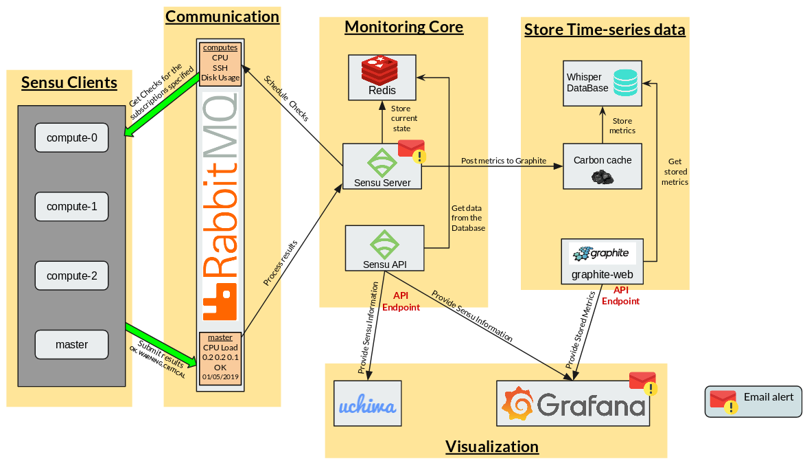

.. _monitoring_architecture-index:

.. role:: bash(code)
   :language: bash

.. role:: yaml(code)
   :language: yaml

Monitoring Architecture
************************

.. contents::

Basic information
=================

- **Deploy date:** 29th July, 2019

Sensu-Graphite-Grafana
=======================

Components
----------

**Monitoring Core:** Provides a scalable event processing platform for processing check results and
monitoring events. [1]_

* **Sensu Server:** Schedules and publishes check execution requests to client subscriptions. [1]_
* **Sensu API:** Provides access to monitoring data collected by Sensu through a RESTful API endpoint.
* **Redis:** In-memory Key-value data structure store, used by Sensu to store monitoring data.

**Sensu Clients:** This layer is composed of the agents that need to be monitored.

**Communication:** Sensu Services use a message bus for communication, sensu check requests and check results
are published as messages to this layer, and the corresponding sensu services receive these messages by
subscribing to the appropriate subscriptions [2]_.

  .. warning:: Using Redis as a transport greatly simplifies Sensu's architecture, however, Redis transport is NOT
			   recommended for production environments. [3]_

* **RabbitMQ:** Message Broker that communicates Sensu Clients with the Server.

**Store Time-series data:** Sensu doesn't store time-series natively, it's necessary to
integrate it with Graphite to have historic registers of the results.

Carbon refers to various daemons that make up the storage backend of a Graphite installation [4]_.
This architecture only needs to use Carbon Cache, but later, Carbon Relay and Carbon aggregator can
be added without problems.

* **Carbon Cache:** listens for metrics and writes them to disk as efficiently
  as possible. This requires caching metric values in RAM as they are received and flushing them to
  disk on an interval using the underlying whisper library. It also provides a query service for
  in-memory metric datapoints, used by the Graphite web app to retrieve “hot data”. [4]_

* **Graphite Web:** Graphite's user interface and RESTful API endpoint.

* **Whisper:** Fixed-size database, similar in design and purpose to RRD (round-robin-database).
  Whisper allows for higher resolution (seconds per point) of recent data to degrade into lower
  resolutions for long-term retention of historical data.

**Visualization:** Displays the configuration, current state and monitoring results.

* **Uchiwa:** Web Dashboard for visualizing Sensu status and Configuration.
* **Grafana:** Shows time-series and monitoring results in dashboards and manage email alerts
  with established thresholds.

WorkFlow
--------

#. Sensu Server schedules the checks, posting pending checks in RabbitMQ for each subscription.
#. Each Sensu Client ask for the checks related to its subscriptions in RabbitMQ
#. After executing the Check, the clients post the results in RabbitMQ
#. Sensu Server processes the results and executes the respective handlers and mutators if necessary.
#. The last results are stored in Redis, registering ONLY the current state of the checks.
#. Sensu API provides that current state (configuration and events) to Grafana and Uchiwa.
#. If the check is configured, Sensu can report a bad execution or an unexpected situation sending
   an email.
#. The checks that have to be stored as TimeSeries pass their results to Carbon Cache.
#. Carbon Cache stores the results until the buffer is full, in this case, it flushes the
   results calling the Whisper Library and storing it as efficiently as possible.
#. Graphite Web provides this stored information through its API Rest endpoint.
#. Grafana takes the results stored in Graphite and creates the desired dashboard.
#. If a threshold is established and an alarm configured in Grafana, it can report an anomaly
   sending an email.

Authors
========

- Andrés Felipe Zapata Palacio <azapat47@eafit.edu.co>

References
===========

.. [1] Sensu Server: Sensu Core 1.5. (n.d.). Retrieved July 30, 2019,
	   from https://docs.sensu.io/sensu-core/1.5/reference/server/

.. [2] Transport: Sensu Core 1.5. (n.d.). Retrieved July 30, 2019,
	   from https://docs.sensu.io/sensu-core/1.5/reference/transport/

.. [3] Redis Configuration: Sensu Core 1.5. (n.d.). Retrieved July 30, 2019,
	   from https://docs.sensu.io/sensu-core/1.5/reference/redis/#how-does-sensu-use-redis

.. [4] The Carbon Daemons. (n.d.). Retrieved July 30, 2019,
	   from https://graphite.readthedocs.io/en/latest/carbon-daemons.html
