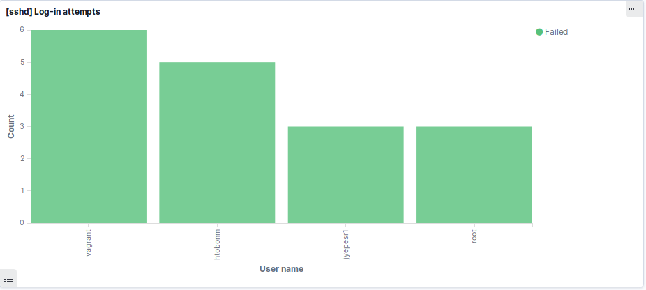

.. _adding-logging-source-index:

.. role:: yaml(code)
   :language: yaml

.. role:: bash(code)
   :language: bash

.. role:: ruby(code)
   :language: ruby

.. role:: json(code)
   :language: json

.. _new-source-7.x:

Adding a new Logging Source
---------------------------
Adding a new logging source is simple if the ELK stack is alreary installed. Follow the following steps:

.. note:: Even though this guide uses Filebeat as log collector, the principles should be the same for others as well.

.. contents::

1. Logging Source
'''''''''''''''''
1. Identify the logging source. For example, it required to track the users that log in to an SSH server. Identify where the service writes its logs. In this case :bash:`/var/log/secure`.

2. Knowing where to take the logs from, identify the messages that are useful. For example:

.. code-block:: bash
   :linenos:

   Jun 25 15:30:02 elk sshd[5086]: pam_unix(sshd:session): session closed for user vagrant
   Jun 25 17:08:11 elk sshd[5185]: Accepted publickey for vagrant from 10.0.2.2 port 54128 ssh2: RSA SHA256:64u6q4IdjxSFhVGdqwJa60y/nMx7oZWb0dAsNqMIMvE
   Jun 25 17:08:11 elk sshd[5185]: pam_unix(sshd:session): session opened for user vagrant by (uid=0)

The first and third logs might not be useful in this case, but the second log is the one that helps.

.. _how-to-filter-7.x:

2. Filtering
''''''''''''
Now it's time to parse and filter the important information. It can be accomplished using Logstash and the Kibana's Grok debugging tool.
Grok is a Logstash filtering plugin used to match patterns and extract useful information from the logs. For more information about Grok read `the documentation <https://www.elastic.co/guide/en/logstash/current/plugins-filters-grok.html>`_.
Follow these steps:

1. Open Kibana. Go to **Dev Tools** -> **Grok Debugger**. Here can be found three main text boxes:

  * The first one is where to put the log that will be filtered.
  * The second one is where a regular expression is written. This regular expression tells Grok how to filter the log.
  * The third one is where Grok shows its results in JSON format, which is the format used by Elasticsearch to inxed everything.

2. But, how to filter an arbitrary log?. Grok uses a regular expression library called `Oniguruma <https://github.com/kkos/oniguruma/blob/master/doc/RE>`_.
This library has a way match patterns in the log. These patterns can be tagged with a name. That name is important because that is how the information will be found in Elasticsearch.
Here is the regular expression that matches the :bash:`timestamp`, the :bash:`event` state (if the user could or couldn't log in), the :bash:`user` that tried to log in,
the :bash:`ip address` that is trying to log in, the :bash:`port` number and the user :bash:`signature`.
Check out the following regular expression:

  .. code-block:: bash

    %{SYSLOGTIMESTAMP:log_timestamp} %{SYSLOGHOST:system_hostname} sshd(.*)?: (?<sshd_event>[a-zA-Z]+) %{DATA:sshd_method} for (invalid user )?%{DATA:sshd_user} from %{IPORHOST:sshd_guest_ip} port %{NUMBER:sshd_guest_port} ssh2(: %{GREEDYDATA:sshd_guest_signature})?

  With the log in the first text box and the regular expression in the second text box, press **Simulate**. Up to this point the Kibana's Grok debugger should look like this:

  .. image:: images/grok.png

3. Let's break down the regular expression into chunks:

   - **%{SYSLOGTIMESTAMP:log_timestamp}**: *SYSLOGTIMESTAMP* is a Grok built-in regular expression. These and many more built-in regular expressions can be found in this `repository <https://github.com/logstash-plugins/logstash-patterns-core/blob/master/patterns/grok-patterns>`_. **log_timestamp** is how was decided to *tag* the matched string. Therefore, this expression will match from **Jun ...** to **... 17:08:11**.
   - **%{SYSLOGHOST:system_hostname}**: *SYSLOGHOST* matches the log hostname and identifies it as **system_hostname**. Note that this is the sshd server's hostname, not the user's hostname.
   - **sshd(.\*)?**: This expression matches the literal string 'sshd', followed by anything except new lines (the dot) '.'. The parentheses are grouping operators, therefore, they group the expression '.*', and this whole expression is optional, '?', which means it might or might not appear in the log. In other words, there might not be something after the word 'sshd', if so, then it won't match anything. Note that this expression doesn't have any identifier, that's because what's matched here is not important.
   - **(?<sshd_event>[a-zA-Z]+)**: This is an important expression. The expression '(?<xxx>...)' can be used when there isn't a default Grok pattern for what is needed. Instead of 'xxx', type the name/tag that will be given to the matched string. Instead of '...' put the regular expression that matches the needed string. In this case, the **event** is composed only by letters, so '[a-zA-Z]' means any lowercase or uppercase letter, the '+' means one or more times. This expression can be replaced by the Grok default pattern **%{DATA:sshd_event}**, but for the purpose of this guide, '(?<xxx>...)' was used so that it can be used whenever needed.
   - **%{DATA:sshd_method}**: *DATA* matches anything (but new lines). The key is that this *anything* may or may not appear, in other words, it's optional. But **sshd_method** is always needed, why to let it as optional?. Well, it's just for simplicity, instead of creating a new regular expression it's simpler to just use the built-in **%{DATA:...}**.
   - **(invalid user )?**: If the event is 'Invalid' instead of 'Accepted' or 'Failed' this string appears, so that's why it is optional.
   - **%{DATA:sshd_user}**: *DATA* matches anything (but new lines), but that anything may or may not appear.
   - **%{IPORHOST:sshd_guest_ip}**: *IPORHOST* matches IP addresses, including IPv6. That IP address is given the identifier *sshd_guest_ip*.
   - **%{NUMBER:sshd_guest_port}**: *NUMBER* matches numbers, in this case, the client's port number.
   - **(: %{GREEDYDATA:sshd_guest_signature})?**: *GREEDYDATA* matches anything (but new lines). In this case, it matches the guest signature, but sometimes it might not appear, so that's why it is enclosed in an optional construct '(...)?'.
   - The other expressions, 'sshd', 'for', 'from', 'port', and 'ssh2' are literal strings, so Grok has to find them in the string that is being parsed, **otherwise the whole string is rejected**.

4. Already having a way to parse the new log, it's time to change the Logstash pipeline configuration. Before proceeding, it's recommended to read this short guide about how a `pipeline configuration file looks <https://www.elastic.co/guide/en/logstash/current/configuration-file-structure.html>`_. Also, it would be very useful to read about what is the purpose of `Logstash <https://www.elastic.co/guide/en/logstash/current/index.html>`_. Go to the end of the *filter* section and add the following:

  .. code-block:: ruby

    if [fromsecure] {

    }

  If this this logging source, :bash:`/var/log/secure`, was added before, don't add that :ruby:`if` sentence, surely it is somewhere else in the *filter* section. But, why :ruby:`[fromsecure]`?, what does that mean?. It checks if the JSON received has a field called :ruby:`fromsecure`. The existence of that field will be explained later in :ref:`add-path-filebeat-7.x`.

5. Under the :ruby:`if` sentence add a :ruby:`grok` block. This is the way of asking to Logstash to use a *filter* plugin, in this case *Grok*. So, add the following:

  .. code-block:: ruby

    grok {
      match => {
        "message" => []
      }
      add_field => {}
    }

  The :ruby:`match` and :ruby:`add_field` sub-blocks ask Grok to use those options. The :ruby:`match` option is used to parse fields, what was explained two subsections before.
  Those fields are passed to the :ruby:`filter` section by the :ruby:`input` section, which in turn receives messages from a *Filebeat* service, or a `Dead letter queue <https://www.elastic.co/guide/en/logstash/current/dead-letter-queues.html>`_.
  The :ruby:`add_field` adds fields to the JSON message in case that the match option successfully matched a string. This is useful in the :ruby:`output` section of the pipeline.
  This is useful to send to Elasticsearch only what was successfully parsed, and not everything that arrives at the :ruby:`input` section.

6. Under the *match* sub-block and the brackets, and between double quotes, add the regular expression built with the Kibana's Grok debugger. Under the :ruby:`add_field` sub-block add the following too:

  .. code-block:: ruby

    grok {
      match => {
        "message" => [
          "%{SYSLOGTIMESTAMP:log_timestamp} %{SYSLOGHOST:system_hostname} sshd(.*)?: (?<sshd_event>[a-zA-Z]+) %{DATA:sshd_method} for (invalid user )?%{DATA:sshd_user} from %{IPORHOST:sshd_guest_ip} port %{NUMBER:sshd_guest_port} ssh2(: %{GREEDYDATA:sshd_guest_signature})?"
        ]
      }
      add_field => {
        "type" => "secure_sshd_login_attempt"
        "secure_correctly_filtered" => "true"
      }
    }

  The :ruby:`type` field serves to differentiate logs in the same *index* in Elasticsearch. For example, :bash:`/var/log/secure` also stores logs about the system security (e.g who executes sudo commands), not only logs about ssh.
  The :ruby:`secure_correctly_filtered` is used in the :ruby:`output` section to send only the information that was correctly filtered.

7. The following filter plugin is **extremely important** to correctly visualize the information. Kibana uses a **metafield**, called :ruby:`@timestamp`, to organize and show the information based on dates.
Logstash adds that field by default when a log is received in the :ruby:`input` section. The problem is that the :ruby:`log_timestamp` field that we added before has a different date, it has the timestamp that corresponds to the log creation.
The time when the log arrives to Logstash is likely to be very different from the time that the log was generated by the service (in this case sshd). There might be a difference of months, even years, because the log that is being indexed might be from the last month/year.
To solve this problem Logstash has a plugin called :ruby:`date`. This plugin can be used to replace the information in the metafield :ruby:`@timestamp` with any other field that has a timestamp, in this case :ruby:`log_timestamp`.
It has more `options <https://www.elastic.co/guide/en/logstash/current/plugins-filters-date.html>`_ than the two presented here. The basic usage is the following:

  .. code-block:: ruby

    date {
      match => [ "log_timestamp", "MMM dd yyyy HH:mm:ss", "MMM d yyyy HH:mm:ss", "MMM dd HH:mm:ss", "MMM d HH:mm:ss" ]
      timezone => "America/Bogota"
    }

  The :ruby:`match` option tells the plugin to parse the field in the first string given in the array, :ruby:`log_timestamp`.
  The following strings are the format in which the field to parse might be built.
  For example, "MMM dd yyyy HH:mm:ss", means that the :ruby:`log_timestamp` field might be in the format:
  Three letter month, MMM. A two digit day, dd. A four digit year, yyyy. A two digit hour, HH. A two digit minutes, mm. And a two digit seconds, ss.
  The rest of the options tells to the plugin that the :ruby:`log_timestamp` field might have those variants.

  The :ruby:`timezone` option tells the plugin to update the timezone in the :ruby:`@timestamp` field to the given timezone.
  Elasticsearch uses UTC as timezone. It cannot be changed, that is, Elasticsearch uses it to work properly.
  Even though we cannot change it, we can update the :ruby:`@timestamp` field with our real timezone because Kibana converts it underneath to the browser's timezone.
  Therefore, it is important to have the **same timezone in the browser and in the logs**.

  .. note:: This plugin is **used by Grok only** in case of successful parse of the log.

8. The following filter plugin is used to remove unnecessary fields from the JSON that will be sent to Elasticsearch. This is how to use it:

  .. code-block:: ruby

    mutate {
        remove_field => ["fromsecure", "log_timestamp"]
    }

  The :ruby:`remove_field` option is given a list of fields that will be removed.

  * The :ruby:`fromsecure` field is used in the :ruby:`if` sentence above, so it's not needed anymore. The procedence of this field is explaned later in :ref:`add-path-filebeat-7.x`.
  * The :ruby:`log_timestamp` is not needed anymore because we already have a field that contains the a timestamp, :ruby:`@timestamp`.

9. Up to this point there is no need for more Logstash filters. Putting everything together should look like this:

  .. literalinclude:: src/templates/etc/logstash/conf.d/guide_main_pipeline.conf.j2
    :linenos:
    :language: ruby

  In summary:

  * The first section, :ruby:`input`, indicates to Logstash where it will receive logs from. In this case Filebeat, on port 5044, and something called the **Dead Letter Queue**. This is where logs that couldn't be indexed go. For example, Logstash received a log, but Elasticsearch crashed, so the log couldn't be indexed, then the log is written to the Dead Letter Queue allowing it to be reindexed later.

  * The last block, :ruby:`output`, indicates to Logstash where it will send logs to. In this case Elasticsearch, which is in the host :ruby:`elk` on port :ruby:`9200`, to the **index** :ruby:`secure`. Elasticsearch indexes will be explained in :ref:`create-indexes-mappings-7.x`, think about them as tables where the logs will be registered.

  * Note the :ruby:`if` sentence in line 42. Recall the :ruby:`add_field` option explained in the Grok filter, well it is used here to send logs to the proper index if and only if, they were correctly filtered by Grok.

10. Restart the Logstash service and hopefully, everything will work perfectly. Sometimes, the service seems to start correctly but it failed reading the pipeline configuration file (what was just written).
To check that everything is perfect check out the log when Logstash is starting, commonly :bash:`/usr/share/logstash/logs/logstash-plain.log`. Logs similar to these are a good signal:

  .. code-block:: bash

    [2019-07-03T10:04:46,238][INFO ][logstash.agent           ] Pipelines running {:count=>1, :running_pipelines=>[:main], :non_running_pipelines=>[]}
    [2019-07-03T10:04:46,705][INFO ][org.logstash.beats.Server] Starting server on port: 5044
    [2019-07-03T10:04:50,337][INFO ][logstash.agent           ] Successfully started Logstash API endpoint {:port=>9600}

.. _create-indexes-mappings-7.x:

3. Creating Indexes and Mappings
''''''''''''''''''''''''''''''''
Indexes are used by Elasticsearch to store the information sent by Logstash. Mappings are a way to structure that data using a JSON format.
Let's see an example to structue the log parsed above, for more information about mappings read `here <https://www.elastic.co/guide/en/elasticsearch/reference/7.1/mapping.html>`_:

  .. code-block:: bash

    PUT /secure
    {
      "mappings":{
        "properties":{
          "type": { "type" : "keyword" },
          "system_hostname":{ "type": "keyword" },
          "sshd_guest_ip":{ "type": "ip" },
          "sshd_guest_port":{ "type": "integer" },
          "sshd_guest_signature":{ "type": "text" },
          "sshd_event":{ "type": "keyword" },
          "sshd_method":{ "type": "keyword" },
          "sshd_user":{ "type": "keyword" }
        }
      }
    }

  Elasticsearch offers a REST API to manage the data. So, *PUT* inserts new information into Elasticsearch. Therefore, if there exists an index with the name *secure*, Elasticsearch will throw an error.
  In that case use *POST*, which is used to update the existing information. So, what does all that stuff mean?:

  * :json:`"mappings"` refers to the property that describes the structure of the index.
  * :json:`"properties"` as its name says, is used to describe the properties of the mappings.
  * The rest of the items are the fields and its types. These fields describe the types of the information parsed in Logstash. For example:

    * :json:`"sshd_guest_ip"` is the field that represents the ip address parsed from the logs. Its type is :json:`"ip"`. Elasticsearch has a built-in type called :json:`"ip"` which eases the indexation and visualization of ip addresses.
    * The :json:`"type"` field is useful to differentiate the logs sent from a single source, in this case :bash:`/var/log/secure`. Recall the :ruby:`add_field` option under the Grok plugin in :ref:`how-to-filter-7.x`, it was added the field: "type" => "sshd_login_attempt". Therefore, in case of indexing the sudo commands logs, change this field to something like: "type" => "secure_sudo_command". This is how to differentiate them easily.

.. _add-path-filebeat-7.x:

4. Adding the log path to Filebeat
''''''''''''''''''''''''''''''''''
Now that the data is filtered and properly structured, it's time to start sending it to Logstash. Go to the machine that has the Filebeat service, edit the file :bash:`/etc/filebeat/filebeat.yml`.
Under the section :yaml:`filebeat.inputs:` add:

  .. code-block:: yaml
    :linenos:

    - type: log
      paths:
        - /var/log/secure*
      fields:
        fromsecure: true
      fields_under_root: true

  What does it mean?:

  * The first line indicates the type of information that will be collected.
  * The second line indicates the paths where the new logging source is located, in this case :yaml:`/var/log/`, and :yaml:`secure*` matches all the logs that start with the name *secure*. This wildcard is used becase some logs have a date at the end of its name, so it will be painful to add over and over again a path when a log appears in :yaml:`/var/log/`.
  * The fourth line, :yaml:`fields`, indicates to Filebeat to add a new field in to the JSON sent to Logstash. Recall the first :ruby:`if` sentence in the :ref:`how-to-filter-7.x` section. Well, this field is added so that all the different logging sources can be differentiated in Logstash.
  * The last option, :yaml:`fields_under_root`, is used to add the fields under the root of the JSON, and not nested into a field called :yaml:`beat`, which is the default behavior.

  Restart the Filebeat service and hopefully everything will work perfectly.
  Otherwise, recall to check the logs usually under :bash:`/usr/share/<service>/logs` or under :bash:`/var/log/<service>`.

5. Create Index Patterns
''''''''''''''''''''''''
With some data indexed in Elasticsearch, create **Index Patterns**. These are used by Kibana to match (using regular expressions) indexes and take the data that will be plotted from those indexes matched by some pattern.

Go to **Management** -> **Index Pattern** -> **Create index pattern**. Select its name/pattern, and as time filter field select :json:`"@timestamp"`.

6 . Plot the data
'''''''''''''''''
One of the easiest plots that can be created is a frequency histogram. Nevertheless, there are lots of more features that Kibana `offers <https://www.elastic.co/guide/en/kibana/current/visualize.html>`_.

In Kibana go to **Visualize**, press the **+** button, select the type of visualization, in this case, **Vertical Bar**. Afther this, select the index pattern that corresponds to the **secure** logs.
Then, to create a frequency historgram of the users that failed logging in follow these steps:

#. In the left hand side of the Kibana web page, there is a subsection called **Buckets**. Click on **X-Axis**.
#. As aggregation select **Terms**. For more information about Term `aggregation <https://www.elastic.co/guide/en/elasticsearch/reference/7.2/search-aggregations-bucket-terms-aggregation.html>`_.
#. As field select **sshd_user**.
#. As custom label write: User name.
#. Now instead of **X-Axis** select **Add sub-buckes**. Then select **Split Series**.
#. Here as aggregation select **Terms** again.
#. As field select **sshd_event**.
#. Now type the following in the bar that is in the upper part of the Kibana's GUI, the **Filters** bar: :bash:`sshd_event : "Failed"`. This is called **Kibana Query Language**, it can be used to filter the data and plot only what is be useful. More information on this query language here, `Kibana Query Language <https://www.elastic.co/guide/en/kibana/7.2/kuery-query.html>`_.
#. Click on the **play** button in the left hand side of the Kibana's GUI.
#. Save the visualization with a descriptive name, something like: *[sshd] Failed attempts to log in*.
#. In case of not having a **Dashboard**, create a new one, then add the visualization. Up to this point it should look something like:

