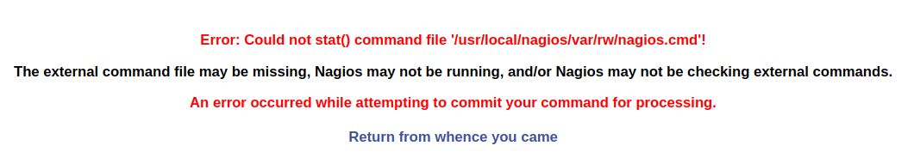

.. _nagios-core-4.4.1-index:

.. role:: bash(code)
   :language: bash

.. role:: yaml(code)
   :language: yaml

Nagios Core - 4.4.1
====================

.. contents::

Basic information
-----------------

- **Deploy date:** 14th August, 2018
- **Official Website:** https://www.nagios.org/about/
- **License:** Nagios Open Software License, Nagios Software License, GNU GENERAL PUBLIC LICENSE

Directory Hierarchy
-------------------

- **bin:** Nagios binaries.

- **dell:** Stores scripts, configuration files, images and
  resources of Dell Plugin.

- **etc:** Stores Nagios configuration files.

- **include**

- **libexec:** Contains most of the plugins installed.

- **sbin:** Nagios scripts

- **share:** Contains Web interface files.

- **var**

Installation
------------

This entry covers the entire process performed for the installation and
configuration of Nagios Core in Centos 7. This process of installation and configuration
is automated using Ansible.

.. toctree::
   :maxdepth: 4

   installation

.. _mail-configuration:

Mail Configuration
------------------

.. note:: This configuration is automatically set up in the step of synchronization in the taskfile :ref:`nagios-config.yml` if the base configuration is included in the synchronization list.

The commands :bash:`notify-host-by-email` and :bash:`notify-service-by-email` were modified adding the flag -A:

   .. code-block:: bash

      /usr/bin/printf "MAIL_BODY" | /bin/mail -A nagios -s "SUBJECT" $CONTACTEMAIL$

   In order to uncouple the mail definition from the command line, the flag :bash:`-A nagios` was added. With this option, **mail** will use the configuration defined in the account nagios, in the file
   :bash:`/etc/mail.rc`

Example:

.. code-block:: bash

   account nagios {
   set smtp=smtp.server.hostname:port
   set sender=nagios@mail
   set from="nagios@mail"
   set ssl-verify=ignore
   }

Plugins
-------

.. toctree::
   :maxdepth: 1

   plugins/nagios-plugins
   plugins/ipmi-sensors
   plugins/dell-openmanage
   plugins/ilo-rest
   plugins/pnp4nagios

Usage
-----

Before executing the role it's important to verify the value of the variables in the file
:bash:`roles/healthckeck/vars/main.yml`. These variables were created in order to uncouple from the code things like IPs, URLs and passwords. In the case of passwords, we used **Ansible Vault** for ciphering them.

.. code-block:: bash

   ansible-vault playbooks/healthcheck.yml --ask-vault-pass

.. caution::

   This Ansible role was created thinking in the Ansible Philosophy: **The tool should be used to represent the state of the server, not as a procedural language but as a declarative one.**

   This role was developed to be run multiple times in the same server: If the real state doesn't matches with the role state, the server is modified in order to match both states. If the server has well configured and well installed Nagios and it's plugins, running the playbook will say **Ok** in most of the tasks, so it  won't break any configuration.

.. note::

   The flag :bash:`--ask-vault-pass` is used because this role uses ansible-vault for encrypting private data like passwords.

Troubleshooting
---------------

.. _nagios-cmd-error:

Nagios Command Error
''''''''''''''''''''

This error occurs when the user generates a modification in the Nagios Command file executing
different actions with the Nagios Web Interface *(eg. re-schedule checks)*. This error is corrected
with the execution of the task :ref:`selinux-config.yml`.

By default, the Apache daemon cannot read/write the files under :bash:`/usr/local/nagios/var/rw` or
execute from :bash:`/usr/local/nagios/sbin` because these directories doesn't belongs to
the :bash:`httpd_sys_rw_content_t` SELinux context and :bash:`httpd_sys_script_exec_t` context
respectively. This is what originates the problem.

Authors
-------

- Andrés Felipe Zapata Palacio <azapat47@eafit.edu.co>
