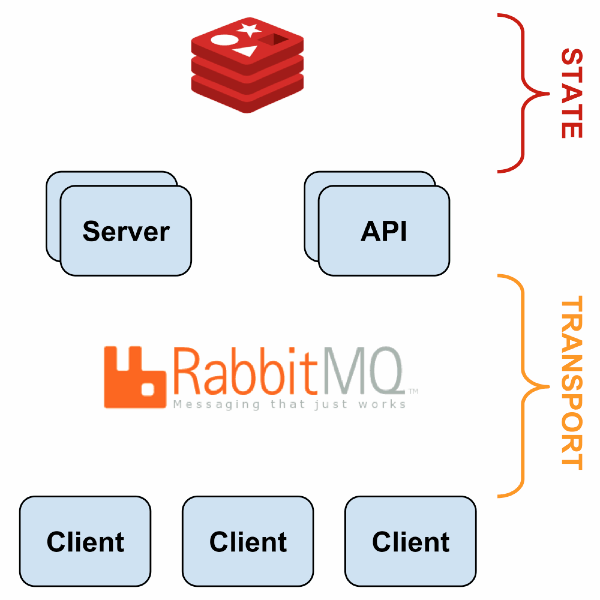
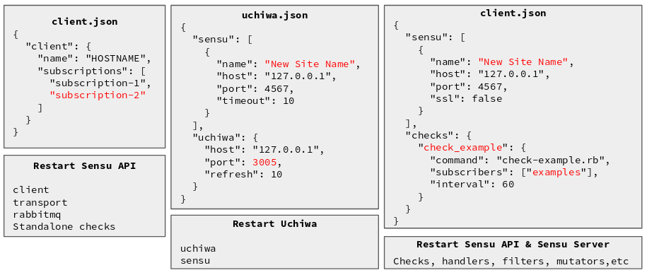
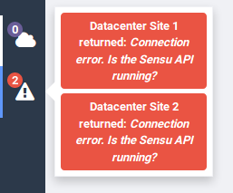

.. _sensu-0.26.5-index:

.. role:: bash(code)
   :language: bash

.. role:: yaml(code)
   :language: yaml

Sensu - 0.26.5
***************

This documentation page describes the process of installation and configuration
of an entire monitoring environment using Sensu as the Core and CentOS 7 as the
base Operating System.

.. contents::

Basic information
=================

- **Deploy date:** 11th June, 2019
- **Official Website:** https://sensu.io/
- **License:** MIT License.

Directory Hierarchy
====================

The two main Sensu directories are:

Installation directory
----------------------

:file:`/opt/sensu` is the installation directory. It contains services, binaries, libraries and
its own Ruby installation with the plugins installed using the command :bash:`sensu-install`.

Configuration directory
-----------------------

:file:`/etc/sensu` contains the configuration files, plugins, and handlers. The configuration definition can be present
in :bash:`/etc/sensu/config.json` or as an independent JSON file in the directory :file:`/etc/sensu/conf.d/`.

.. _sensu_services:

Introduction
============

The general sensu architecture is summarized as one or more servers that assign
monitoring tasks to its clients through a message broker, and stores the results
in a Database in Memory. Information like configuration and results is provided
through an API.

Sensu Services
===============

* **sensu-client:** It executes the tasks indicated in the Message Broker (RabbitMQ) by the Sensu server. It's
  necessary to restart it if the client configuration changes (local checks, address, etc) to refresh the configuration.
  If you change a configuration in the client, it's not necessary to restart the server.

* **sensu-server:** Distributes the monitoring tasks through the message broker, and reacts executing the specified
  handlers when a result has a critical or warning state. It's necessary to restart it if the server
  configuration changes (checks, handlers, etc) in order to refresh its execution parameters
  (send monitoring tasks and receive results).

* **sensu-api:** Manages the service information provided from the Sensu-server to external systems like Uchiwa. It's
  necessary to restart it if the server configuration changes (checks, handlers, etc) in order to update the informative layer.

Concepts
=========

* **Clients:** Monitoring agents that execute checks and replies the results to its associated Sensu Server.

* **Subscriptions:** A name that groups 0 or more clients around one particular role or responsibility.

* **Checks:** Commands executed by the Sensu client which monitor a condition or collect measurements (server resources, services, etc).

* **Handlers:** Actions executed by the Sensu server on events, such as sending an email alert, creating or resolving an incident (e.g. in PagerDuty, ServiceNow, etc), or storing metrics in a time-series database (e.g. Graphite).

* **Mutators:** Transform event data prior to handling (i.e. add new attributes to the response)

* **Plugins:** Provide executable scripts or other programs that can be used as Sensu checks, handlers or mutators.

* **Filters:** Inspect event data and match its keys/values with filter definition attributes, to determine if the event should be passed to an event handler. Filters are commonly used to filter recurring events (i.e. to eliminate notification noise).

For more information, read [2]_.

Installation
============

This first installation procedure is the same in both: Sensu Server and
Sensu Client. The procedure is explained for a machine whose Operating
System is CentOS 7.

#. Install the Epel-Release repository

   .. code-block:: bash

      $ yum install epel-release

#. Add the Official Sensu repository, adding the following file
   to :bash:`/etc/yum.repos.d/sensu.repo`

   .. literalinclude:: src/sensu.repo
      :language: bash

#. Install Sensu

   .. code-block:: bash

      $ yum install sensu

Sensu Server
------------

.. note:: It's important to know that a Sensu Server can be also a Sensu Client.

After executing the previous steps, if you are not installing the Sensu
Client, but the Sensu Server, proceed as follows:

#. Install the additional dependencies for managing the communication between
   clients-server.

   * **RabbitMQ** is the message broker that manages the communication.
   * **Erlang** is a programming language and a runtime dependency for RabbitMQ.
   * **Redis** works as Database in Memory and stores temporarily the monitoring information.
   * **Uchiwa** is a web Dashboard for visualizing Sensu status and Configuration.

   .. code-block:: bash

      $ yum install erlang redis uchiwa

   RabbitMQ can be installed from its official RPM:

   .. code-block:: bash

      $ yum install https://www.rabbitmq.com/releases/rabbitmq-server/v3.6.6/rabbitmq-server-3.6.6-1.el6.noarch.rpm

Configuration
=============

Service configuration
---------------------

You should start and enable at boot time the following services:

1. Sensu Client
''''''''''''''''

* sensu-client

2. Sensu Server
''''''''''''''''

* uchiwa
* sensu-server
* sensu-api
* redis
* rabbitmq-server

RabbitMQ Configuration
----------------------

It's necessary to define authentication credentials to let Clients
communicate in a secure way with the Sensu Server through the Message
Broker RabbitMQ. This procedure is executed only once in the Sensu
Server.

.. code-block:: bash

   $ rabbitmqctl add_vhost /sensu
   $ rabbitmqctl add_user sensu PASSWORD
   $ rabbitmqctl set_permissions -p /sensu sensu ".*" ".*" ".*"

Sensu Configuration
-------------------

1. Sensu Client
''''''''''''''''

#. Add the Client definition in :bash:`/etc/sensu/config.json` or in any file with *json* extension into the directory
   :bash:`/etc/sensu/conf.d/`, specifying hostname, subscriptions, etc.

   **Example: /etc/sensu/conf.d/client.json**

   .. literalinclude:: src/client.json
      :language: bash

#. Add the Transport definition in the configuration directory:

   **Example: /etc/sensu/conf.d/transport.json**

   .. literalinclude:: src/transport.json
      :language: bash

#. Add the RabbitMQ definition specifying the credentials previously
   defined:

**Example: /etc/sensu/conf.d/rabbitmq.json**

   .. literalinclude:: src/rabbitmq.json
      :language: bash

2. Sensu Server
''''''''''''''''

Add the Uchiwa configuration file:

**Example: /etc/sensu/conf.d/uchiwa.json**

   .. literalinclude:: src/uchiwa.json
      :language: bash

Plugins
========

Excluding the specific configurations that each plugin can have, the general
process to add a plugin is described as follows:

#. Download the script into a directory readable by **sensu** user.

#. Define the check configuration in :bash:`/etc/sensu/config.json` or as an
   independent JSON file in :bash:`/etc/sensu/conf.d/`, specifying the execution
   line, frequency, and which subscribers will be associated with the check.

#. Restart **sensu-server** and **sensu-api**. If the check is defined as standalone
   (locally in the client) restart **sensu-client**.

.. toctree::
   :maxdepth: 1

   plugins/remediator
   plugins/mailer
   plugins/process
   plugins/graphite
   plugins/cpu-load
   plugins/disk-usage
   plugins/check-memory
   plugins/network-interface
   plugins/check-sensors

Integration with Ansible
=========================

We implemented a Role in Ansible that contains the whole process of installation and configuration
of a Sensu Client, and it's integration with some plugins. Configuration files are generated dynamically
using Ansible templates and pre-defined variables in the role.

The structure is:

.. code-block:: bash

	---
	sensu_clients_data:
	  compute-1:
	    subscriptions: ["compute-node","nvidia-gpu"]
	  compute-2:
	    subscriptions: ["compute-node"]

These subscriptions define the values present in the configuration file :bash:`client.json`.

Later in this documentation, these subscriptions are used also as conditionals in Ansible
for the plugins installation and configuration.

Add a new Plugin
-----------------

This procedure explains the general steps required to support a new plugin within
the Sensu-Clients ansible role.

.. note:: The steps show the configuration of GPU Nvidia Plugin as an example.

#. Add a new subscription or use an existing one to associate the desired
   nodes with this plugin:

   .. literalinclude:: src/tasks/vars.yml

#. Install the dependencies if needed. You can add a conditional that
   checks if the current machine has the corresponding subscription defined.

	**Example:**

	.. code-block:: bash

		when: '"nvidia-gpu" in sensu_clients_data[inventory_hostname].subscriptions'

#. Check if the plugin is installed (i.e verifying the presence of the script)
   and register this state into an Ansible variable:

   .. literalinclude:: src/tasks/check-plugin.yml

#. Install the plugin if its presence was not registered in the last step:

   .. literalinclude:: src/tasks/install-plugin.yml

You can add a second conditional that executes this installation only if
the current machine has the corresponding subscriptions defined.

	**Example:**

	.. code-block:: bash

		  when '"nvidia-gpu" in sensu_clients_data[inventory_hostname].subscriptions'

Troubleshooting
================

Connection error. Is the Sensu API running?
--------------------------------------------

**PROBLEM:**
Datacenter Site 1 returned: Connection error. Is the Sensu API running?

**REASON 1:** uchiwa.json has the default configuration (Two generic Datacenter configurations)

**SOLUTION:** Edit uchiwa.json with real information and restart uchiwa service.

**REASON 2:** Redis doesn't support ipv6 (localhost resolves to ::1). Using "localhost" instead of 127.0.0.1 for the host configuration on systems that support IPv6 may result in an IPv6 “localhost” resolution (i.e. ::1) rather than an IPv4 “localhost” resolution [1]_

**SOLUTION:** Update the Redis configuration (by default located in :bash:`/etc/sensu/config.json`), changing  the attribute "host" as follows:

   .. literalinclude:: src/redis.json
      :language: bash

After that, please restart the sensu-server service.

Authors
========

- Andrés Felipe Zapata Palacio <azapat47@eafit.edu.co>

References
===========

.. [1] Redis Configuration | Sensu Docs. Retrieved June 12, 2019,
       from https://docs.sensu.io/sensu-core/1.0/reference/redis/#redis-definition-specification

.. [2] Sensu Reference | Sensu Core 0.29. (n.d.). Retrieved June 17, 2019,
       from https://docs.sensu.io/sensu-core/0.29/reference/
