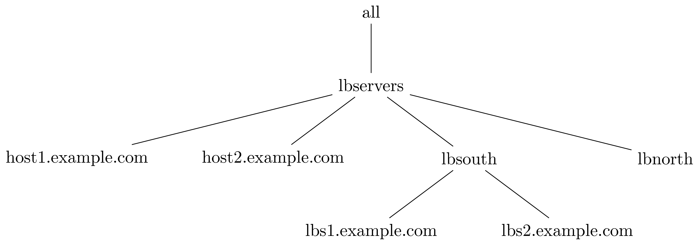
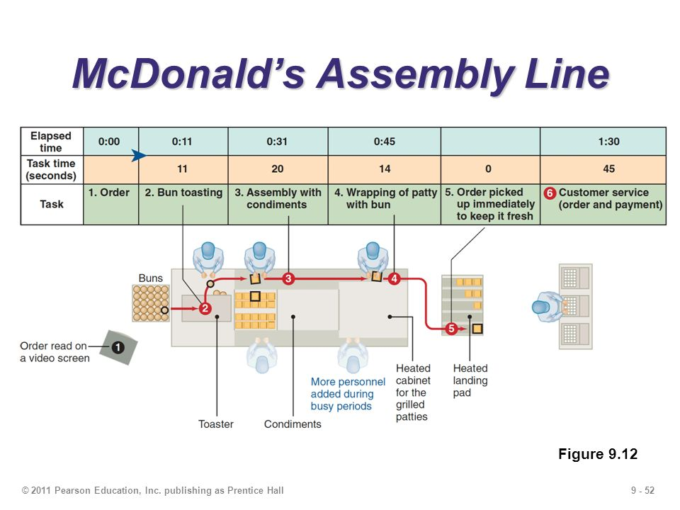

.. _ansible-preliminaries:

.. highlight:: rst

.. role:: bash(code)
   :language: bash

.. role:: raw-html(raw)
   :format: html

.. _sssec-ansible_inventory:

Inventory
---------------------

Ansible performs actions, also known as tasks, over a group of computers; in order to
do so it reads a plain text file called "inventory file" containing a list of
hostnames, or IP addresses, often grouped based on one or multiple shared features.

The inventory file is located by default under :bash:`/etc/ansible/hosts`
and would typically follow the conventions shown below:

#. Group names are delimited by :bash:`[` and :bash:`]`. e.g. group lbservers would be written as :bash:`[lbservers]`.
#. Hosts below a group definition are to be taken as members of it. e.g.

   .. code-block:: ini

      ; lbservers -> Group
      ; [host1,host2].example.com -> Members
      [lbservers]
      host1.example.com
      host2.example.com

   .. figure:: src/images/inventory_example-1/inventory_example-1.png
      :alt: lbservers' components

#. Using the suffix :bash:`:children` within a group definition indicates the presence of
   nested groups (i.e. subgroups). e.g.

   .. code-block:: ini

      ; lbservers -> Group
      ; lb[south,north] -> Subgroups
      [lbservers:children]
      lbsouth
      lbnorth

   .. note::

      Subgroups are only declared as part of a parent-child relation
      (i.e. nesting depth is 1), thus implying that relations where
      nesting depth is greater than 1 require multiple declarations.

   .. code-block:: ini

      ; lbservers -> Grandparent
      ; lb[south,north] -> Children
      [lbservers:children]
      lbsouth
      lbnorth

      ; lbs[1,2].example.com -> Grandchildren
      [lbsouth]
      lbs1.example.com
      lbs2.example.com

#. The suffix :bash:`:vars` within a group definition is used to declare and assign
   variables to a particular set of hosts or subgroups. e.g.

   .. note::

      These variables are relative to group members and can be overwritten
      by subgroups and other ansible components (e.g. playbooks, tasks).
      See `Ansible's Variable Precedence article`_ for more information.

      .. _`Ansible's Variable Precedence article`: https://docs.ansible.com/ansible/latest/user_guide/playbooks_variables.html#variable-precedence-where-should-i-put-a-variable

   .. code-block:: ini

      ; lbsouth and lbnorth will inherit all
      ; variables declared within lbservers.
      [lbservers:children]
      lbsouth
      lbnorth

      [lbservers:vars]
      requests_timeout=5
      max_hosts_to_serve=10

      ; "requests_timeout" will be overwritten
      ; for lbsouth members only.
      [lbsouth:vars]
      requests_timeout=3

      ; Members of this group will not recognize
      ; variables declared for lbservers, as they
      ; do not belong to it.
      [backupservers]
      bk1.example.com
      bk2.example.com

   .. figure:: src/images/inventory_example-children/inventory_example-children.png
      :alt: lbservers' components

It is impotant to highlight that there are two default groups: :bash:`all` and
:bash:`ungrouped`, which, unlike any other group, can be omitted within the
inventory file, as their definitions are both implicit. Please be aware that:

#. Hierarchically, all groups and hosts are members of :bash:`all`.

#. Hosts with no group other than all belong to :bash:`ungrouped`. Therefore, hosts
   will be members of at least two groups.

Hence, it is true for the examples above:

.. _sssec-ansible_groupvars:

Group variables
---------------------

.. note::

   This feature will not be detailed, as there is plenty of information about it in
   `Ansible's document: Working with Inventory`_

   .. _`Ansible's document: Working with Inventory`: https://docs.ansible.com/ansible/latest/user_guide/intro_inventory.html#splitting-out-host-and-group-specific-data

Keeping too much data within the inventory file can make it become complex, difficult
to read and maintain. Ansible allows to easily bypass this issue by introducing a
mechanism to split groups and hosts data:

#. Create a folder called :bash:`group_vars` at the same level as the inventory file.
   That is, if the inventory file is located under :bash:`$ANSIBLE_HOME` then the
   folder must be there as well. e.g.

   .. code-block:: bash

      mkdir -p $ANSIBLE_HOME/group_vars
      ls $ANSIBLE_HOME/
      inventory    group_vars/

#. Create files under :bash:`group_vars` matching your group names and store the
   corresponding variables into each one. Take the example from the `Inventory`_
   section; There are variables declared for two groups, hence there would be
   two files under :bash:`group_vars` as shown below:

   .. code-block:: yaml

      # $ANSIBLE_HOME/group_vars/lbservers
      ---
      requests_timeout: 5
      max_hosts_to_serve: 10

   .. code-block:: yaml

      # $ANSIBLE_HOME/group_vars/lbsouth
      ---
      requests_timeout: 3

Moreover, variables within a group can be further organized by decoupling the
files inside :bash:`group_vars`. Ansible will read all files under
directories named after groups or hosts. For instance, variables from the
lbservers group can reside in multiple files under
:bash:`$ANSIBLE_HOME/group_vars/lbservers/`. e.g.

   .. code-block:: yaml

      # $ANSIBLE_HOME/group_vars/lbservers/requests
      ---
      requests_timeout: 5

   .. code-block:: yaml

      # $ANSIBLE_HOME/group_vars/lbservers/config
      ---
      max_hosts_to_serve: 10

.. _sssec-ansible_modules:

Modules
---------------------

A module can be interpreted as a function ansible calls from a task. Basically,
a module is the function's entire body (i.e. declaration), waiting to be
called from a task or an ansible ad-hoc command.

.. _sssec-ansible_playbooks:

Playbooks
---------------------

A playbook is a text file, written in YAMl format, containing information on
which tasks to apply on which hosts. This information is contained within a
definition block called "Play". Take the following playbook for example:

.. code-block:: yaml

   ---
   - hosts: lbsouth
     vars:
       nginx_conf_dir: /etc/nginx/

   - hosts: lbnorth
     vars:
       nginx_conf_dir: /opt/nginx/

   - hosts: lbservers
     vars:
       nginx_log_dir: /var/log/ansible
     tasks:
     - name: Install/update nginx
       yum:
         name: nginx
	 state: latest
     - name: Place nginx config file
       template:
         src: templates/nginx.conf.j2
	 dest: "{{ nginx_conf_dir }}/nginx.conf"
       notify:
         - restart nginx
     - name: Ensure nginx is running
       systemd:
         name: nginx
	 state: started
	 enabled: true
     handlers:
       - name: restart nginx
	 systemd:
	   name: nginx
	   state: restarted

Plays are separated by a non-printable '\\n', thus there are three plays. Each one
uses the keyword "hosts" to describe a group, defined in the inventory file,
on which to apply some tasks and/or set variables, keywords "tasks" and "vars"
respectively.

An easy way to comprehend what a playbook is, and why it is useful, is thinking on
what would one need to do in scripting languages, like bash, to accomplish what
a playbook is meant to. Take the task "Place nginx config file". It calls
Ansible's :bash:`template` module, which creates a file based
on a Jinja2 template. Hence, one could either use templates alongside bash, which
becomes complex and difficult to maintain really fast, use an external software to
parse them, like ruby :bash:`erb` or python + Jinja2, or manage static
files. Thereupon, additional concerns arise: how to deliver
files to lbservers' hosts?, how to manage variables within them?, etc. Basically,
these questions represent steps to achieve something specific (for the task under
consideration, place a file called :bash:`nginx.conf`, whose content may vary,
on all hosts within lbservers) that can be interpreted as to lead a system to a
desired state. e.g.

- Original state: lbservers' hosts not having :bash:`nginx.conf`
- Desired state: lbservers' hosts having :bash:`nginx.conf`

A playbook can be, therefore, defined as the abstraction of a system's final state,
comprised of intermediate states represented by tasks.
Sort of an assembly line analogy:

   McDonald's assembly line. Retrieved august 28, 2018 from https://slideplayer.com/slide/9882222/

Task 1 would represent an ansible run being triggered, tasks 2 to 5 the system's pass
through each intermediate state
(i.e. bun toasted, bun assembled with condiments, patty wrapped,
Order placed on heated landing pad) and task 6 the desired state (i.e. customer satisfied).

.. _sssec-ansible_roles:

Roles
---------------------

A role is a hierarchical directory structure intended to decouple playbooks
by breaking them into multiple files, which is particularly useful to
create reusable components and write simpler playbooks.
A role's layout would typically look as below:

.. note::

   There are more directories than those listed below. See `Ansible's official documentation`_
   for more information.

.. _`Ansible's official documentation`: https://docs.ansible.com/ansible/2.5/user_guide/playbooks_reuse_roles.html

.. code-block:: bash

   <playbook 1>
   <playbook 2>
   .
   .
   .
   <playbook n>
   inventory
   roles/
     common/
       tasks/
       handlers/
       files/
       templates/
       vars/

Let us elucidate on how playbooks can be decoupled by using the notion of a role. Take the
example on the `Playbooks`_ section.

#. **Identify a common feature within your tasks**. For example, all tasks on the
   third play are related to nginx.

#. Use that common feature as a base to name your role and create a directory
   under :bash:`$ANSIBLE_HOME/roles`.

   .. note::

      :bash:`$ANSIBLE_HOME` is used as a way to represent ansible's folder
      location within the filesystem (e.g. /etc/ansible), which
      may vary depending on the setup.

   .. code-block:: bash

      mkdir -p  $ANSIBLE_HOME/roles/nginx

#. **Decouple tasks by placing them in taskfiles**. As the name implies, a taskfile is
   a file containing task declarations; this files are often stored under
   :bash:`$ANSIBLE_HOME/roles/<role>/tasks` and their name is irrelevant exept
   for :bash:`main.yml`, which must always be present. Although tasks can be all defined
   inside :bash:`main.yml`, it is recommended to declare them in different taskfiles
   when their number is large enough to make a coupled taskfile difficult to read, and then
   call each one from :bash:`main.yml`.

   .. code-block:: yaml

      # $ANSIBLE_HOME/roles/nginx/tasks/packages.yml
      ---
      - name: Install/update nginx
	yum:
	  name: nginx
	  state: latest

   .. code-block:: yaml

      # $ANSIBLE_HOME/roles/nginx/tasks/config.yml
      ---
      - name: Place nginx config file
       template:
         src: templates/nginx.conf.j2
	 dest: "{{ nginx_conf_dir }}/nginx.conf"
       notify:
         - restart nginx

      - name: Ensure nginx is running
	systemd:
          name: nginx
	  state: started
	  enabled: true

   .. code-block:: yaml

      # $ANSIBLE_HOME/roles/nginx/tasks/main.yml
      ---
      - name: "Including taskfile {{ taskfile }}"
	include_tasks: "{{ taskfile }}"
	with_items:
	  - 'packages.yml'
	  - 'config.yml'
	loop_control:
	  loop_var: taskfile

#. **Decouple variables**. Declare them as `Group variables`_, in the role's local
   context or within a task. For instance, if one desires the variable
   :bash:`nginx_log_dir` to be set for all hosts applying the nginx role:

   .. note::

      Using :bash:`$ANSIBLE_HOME/roles/<role>/vars` to store variables visible to all
      tasks within a role is a common practice. However, "vars" can be named
      differently or even placed under some other location.

      One would typically store variables inside
      :bash:`$ANSIBLE_HOME/roles/<role>/vars/main.yml` as for ansible to auto-load
      them, but there is also the alternative to do it manually (shown in this example).

   .. code-block:: bash

      mkdir -p $ANSIBLE_HOME/roles/nginx/vars

   .. code-block:: yaml

      # $ANSIBLE_HOME/roles/nginx/vars/config.yml
      ---
      nginx_log_dir: /var/log/ansible

   .. code-block:: yaml

      # $ANSIBLE_HOME/roles/nginx/tasks/main.yml
      ---
      # Unlike group_vars, ansible does not read files
      # inside the vars folder automatically, except "main.yml".
      # Therefore, in this case, it must explicitly be told to do so.
      # Remark: vars' location may vary.
      - name: 'Include variables'
	include_vars:
	  dir: '../vars'
	  extensions:
	    - yml

      - name: "Including taskfile {{ taskfile }}"
	include_tasks: "{{ taskfile }}"
	with_items:
	  - 'packages.yml'
	  - 'config.yml'
	loop_control:
	  loop_var: taskfile

   As for the variables under :bash:`lbsouth` and :bash:`lbnorth`:

   .. code-block:: yaml

      # $ANSIBLE_HOME/group_vars/lbnorth
      ---
      nginx_conf_dir: /opt/nginx/conf

   .. code-block:: yaml

      # $ANSIBLE_HOME/group_vars/lbsouth
      ---
      requests_timeout: 3
      nginx_conf_dir: /etc/nginx/conf

#. **Decouple handlers**. Handlers are stored the same way taskfiles are, but in
   a different location. They are placed inside the "handler" directory, which
   is at the same level as the "tasks" directory.

   .. code-block:: bash

      mkdir -p $ANSIBLE_HOME/roles/nginx/handlers

   .. code-block:: yaml

      # $ANSIBLE_HOME/roles/nginx/handlers/main.yml
      ---
      - name: restart nginx
	systemd:
	  name: nginx
	  state: restarted

#. **Decouple templates**. Stored under :bash:`$ANSIBLE_HOME/roles/<role>/templates`,
   it is highly recommended to create a directory structure resembling that of the
   location where templates will be rendered. e.g. :bash:`nginx.conf` will be
   rendered in :bash:`/etc/nginx/conf` for :bash:`lbsouth` and :bash:`/opt/nginx/conf`,
   for :bash:`lbnorth`, hence the template would reside in either
   :bash:`$ANSIBLE_HOME/roles/nginx/templates/etc/nginx/conf` or
   :bash:`$ANSIBLE_HOME/roles/nginx/templates/opt/nginx/conf`. Note modifying the layout
   also implies adjusting all tasks using :bash:`nginx.conf.j2`.

   .. code-block:: yaml
      :linenos:
      :emphasize-lines: 5

      # $ANSIBLE_HOME/roles/nginx/tasks/config.yml
      ---
      - name: Place nginx config file
       template:
         src: templates/etc/nginx/conf/nginx.conf.j2
	 dest: "{{ nginx_conf_dir }}/nginx.conf"
       notify:
         - restart nginx

      - name: Ensure nginx is running
	systemd:
          name: nginx
	  state: started
	  enabled: true

#. **Call the role** from the playbook (Note how it became simpler).

   .. code-block:: yaml

      ---
      - hosts: lbservers
	roles:
	  - nginx

Finally, consider the designated behavior for each role 'x' component
(Taken from [#five]_):

- If roles/x/tasks/main.yml exists, tasks listed therein will be added to the play.
- If roles/x/handlers/main.yml exists, handlers listed therein will be added to the play.
- If roles/x/vars/main.yml exists, variables listed therein will be added to the play.
- If roles/x/defaults/main.yml exists, variables listed therein will be added to the play.
- If roles/x/meta/main.yml exists, any role dependencies listed therein will be added to the list of roles (ansible 1.3 and later).
- Any copy, script, template or include tasks (in the role) can reference files in roles/x/{files,templates,tasks}/ (dir depends on task) without having to path them relatively or absolutely.

.. _sssec-ansible_vault:

Vault (Encryption)
---------------------

.. note::

   Some features will not be detailed. Basic usage can be found in
   `Ansible's document: Ansible Vault`_

   .. _`Ansible's document: Ansible Vault`: https://docs.ansible.com/ansible/latest/user_guide/vault.html?highlight=vault

"New in Ansible 1.5, “Vault” is a feature of ansible that allows keeping sensitive data such as passwords
or keys in encrypted files, rather than as plaintext in your playbooks or roles. These vault files can
then be distributed or placed in source control." [#one]_

Create encrypted files
~~~~~~~~~~~~~~~~~~~~~~
The command below will create a temporary file and subsequentially
open it for you to write. Once the file is saved, and the text editor closed,
*ansible-vault* will automatically generate an encrypted version of it and erase
the original.

  .. code-block:: bash

     ansible-vault --vault-id <env>@<vault-password script> create <file>

Alternatively, if you intend to be prompted for the password, then:

  .. code-block:: bash

     # You could also use:
     # ansible-vault create <file>
     # However, environments would not be taked into consideration.
     ansible-vault --vault-id <env>@prompt create <file>

Encrypt files
~~~~~~~~~~~~~

  .. code-block:: bash

     ansible-vault --vault-id <env>@<vault-password script> encrypt <file-1> [file-2 file-3 ... file-n]

Encrypt variables as a string
~~~~~~~~~~~~~~~~~~~~~~~~~~~~~

  .. code-block:: bash

     ansible-vault encrypt_string --vault-id <env>@<vault-password script> --stdin-name '<varname>'

Edit encrypted files
~~~~~~~~~~~~~~~~~~~~

Encrypted files can be edited without being decrypted a priori. See the command below:

  .. code-block:: bash

     ansible-vault --vault-id <env>@<vault-password script> edit <file>

View encrypted file
~~~~~~~~~~~~~~~~~~~

  .. code-block:: bash

     ansible-vault --vault-id <env>@<vault-password script> view <file>

View encrypted string
~~~~~~~~~~~~~~~~~~~~~

   .. code-block:: bash

      ansible localhost -m debug -a var='<variable_to_decrypt>' \
      -e "@<file_containing_variable>" \
      --vault-id <env>@<vault-password script>

Decrypt files
~~~~~~~~~~~~~

  .. code-block:: bash

     ansible-vault --vault-id <env>@<vault-password script> decrypt <file-1> [file-2 file-3 ... file-n]

Change encryption key
~~~~~~~~~~~~~~~~~~~~~

  .. code-block:: bash

     ansible-vault rekey <file-1> [file-2 file-3 ... file-n]

vault-password script
~~~~~~~~~~~~~~~~~~~~~

Vault's password can be retrieved from a script, as described in [#two]_, passed to the
option :bash:`--vault-id`, or :bash:`--vault-password-file`
from the :bash:`ansible-vault` and :bash:`ansible-playbook` executables.

.. note::

   The script can be written in python, bash or any other scripting language.

Scripts invoked by :bash:`--vault-password-file` take no arguments,
return the password on stdout and do not have any knowledge about :bash:`--vault-id`
or multiple password files whatsoever. Using :bash:`--vault-id` to call upon
scripts, on the other hand, enables a 'protocol' under which a vault id can be
looked up and its associated password returned thereafter.

Furthermore, :bash:`--vault-id` allows for a vault id to be passed a
as an argument thus giving developers the ability to
program more sophisticated vault-password scripts.

.. warning::

   - A vault id will only be passed to the script if the latter is named after the
     convention :bash:`<some name>-client.<extension>` (e.g. :bash:`keyring-client.sh`).
     See [#three]_ and [#four]_ for more information.

   - Make sure the script is executable. Otherwise, ansible will not be able
     to use it.

For instance,

.. code-block:: bash

   ansible-playbook --vault-id some_id@/path/to/keyring-client.sh some_playbook.yml

will result in :bash:`keyring-client.sh` to be invoked as:

.. code-block:: bash

   /path/to/keyring-client.sh --vault-id some_id

Let us delve into a more detailed example:

**Assumptions**

#. Ansible is being run from
   three clusters.Cluster orchestrators (masters) are
   named after the convention :bash:`cluster<cluster number>.<domain>` and
   compute nodes :bash:`compute<cluster number>-<number>`. e.g. Cluster 1
   is comprised of :bash:`cluster1.local` and  :bash:`compute-1-0.local`,
   :bash:`compute-1-1.local`.

#. Clusters 1 and 2 belong to the production environment. Cluster 3 belongs to
   the development environment.

#. Servers from a particular cluster cannot access servers from other
   cluster.

#. The script :bash:`/usr/sbin/keyring-client.sh` has the content shown below:

   .. code-block:: bash
      :linenos:

      #!/bin/bash

      case $1 in
        "--vault-id")
        declare -r env="$2"
        ;;
      *)
        exit 1
        ;;
      esac

      declare -r cluster=`hostname | awk -F'.' '{print $1}'`
      declare -r cmd="ssh remote \
      cat /etc/secrets/$env/$cluster"

      declare -r vault_passwd="$($cmd)"

      echo "$vault_passwd"

#. The vault id reprents an environment: dev (development), prod (production).

#. A server called :bash:`remote` (see line 13 from script) holds multiple passwords,
   one per cluster, stored under :bash:`/etc/secrets/<environment>/<cluster>`:

   - :bash:`/etc/secrets/prod/cluster1`
   - :bash:`/etc/secrets/prod/cluster2`
   - :bash:`/etc/secrets/dev/cluster3`

**Sample use case**

#. Create a git repository to hold ansible's information.

   .. code-block:: bash

      mkdir -p ~/ansible
      cd ~/ansible
      git init

#. Create an inventory file.

   .. code-block:: INI

      ; ~/ansible/inventory

      [cluster1]
      cluster1.local
      compute-1-0.local
      compute-1-1.local

      [cluster2]
      cluster2.local
      compute-2-0.local
      compute-2-1.local

      [cluster3]
      cluster3.local
      compute-3-0.local
      compute-3-1.local

      [clusters]
      cluster1
      cluster2
      cluster3

#. Create a playbook to change the root password. Since repeating code is an awful
   practice, we decided to create a reusable task and manage the user password
   through a variable.

   .. code-block:: yaml

      # ~/ansible/playbook.yml
      ---
      - hosts: clusters
	tasks:
	- name: Set root password
	  user:
	    name: root
	    password: "{{ root_password_hash }}"

#. Retrive each root password hash.

   .. code-block:: bash

      # Password - cluster1: 123
      openssl passwd -1 -salt
      Password:
      Verifying - Password:
      $1$PpScqWH9$/Rpsq9/mJVxnaCEmrSAv31
      # Password - cluster2: 456
      openssl passwd -1 -salt
      Password:
      Verifying - Password:
      $1$RB/C07h4$t1lWpEQO/APEBwYPyhjai1
      # Password - cluster3: 789
      openssl passwd -1 -salt
      Password:
      Verifying - Password:
      $1$mRBrUoTy$xAoiS8xIeT6pm8HZZvKmL1

#. Encrypt the hashes using the vault-password
   script. Note the process is exactly the same for all
   servers (login, run ansible-vault, paste hash, press Ctrl-d, retrieve hash),
   therefore showing it for one will be enough of a clarification.

   .. caution::

      - DO NOT underestimate string trimming. That is, Vault does not
	trim any \\n. Hence, pasting the hash, pressing [Return] and then
	[Ctrl]-[d] would include an EOL.

      - Remember to give Vault's --vault-id option the apropriate
	environment for each server.

   .. code-block:: bash

      ssh cluster1.local
      ansible-vault encrypt_string \
      --vault-id prod@/usr/sbin/keyring-client.sh \
      --stdin-name 'root_password_hash'
      Reading plaintext input from stdin. (ctrl-d to end input)
      $1$PpScqWH9$/Rpsq9/mJVxnaCEmrSAv31root_password_hash: !vault |
          $ANSIBLE_VAULT;1.2;AES256;prod
          34376666646335616561643965613763613163623262663262313961613262316565623237363434
          6138363635336330616364633539653466323264653133330a326465346136383635343961346434
          66376665356534616366333465346166633364373438623133623363303262343464663266623337
          6136363864643936620a373734656435376331393265653138613835336237636437656666663361
          66636130613232383766656134306566353562333166323164663731623238353430633830343833
          6131643734643639383332613635323264363065316464366232
      Encryption successful
      exit

#. Create the group variable :bash:`root_password_hash` and assign it the
   appropriate hash.

   .. code-block:: bash

      mkdir -p ~/ansible/group_vars

   .. code-block:: yaml

      # ~/ansible/group_vars/cluster1
      ---
      root_password_hash: !vault |
          $ANSIBLE_VAULT;1.2;AES256;prod
          34376666646335616561643965613763613163623262663262313961613262316565623237363434
          6138363635336330616364633539653466323264653133330a326465346136383635343961346434
          66376665356534616366333465346166633364373438623133623363303262343464663266623337
          6136363864643936620a373734656435376331393265653138613835336237636437656666663361
          66636130613232383766656134306566353562333166323164663731623238353430633830343833
          6131643734643639383332613635323264363065316464366232

   .. code-block:: yaml

      # ~/ansible/group_vars/cluster2
      ---
      root_password_hash: !vault |
          $ANSIBLE_VAULT;1.2;AES256;prod
          <encrypted hash>

   .. code-block:: yaml

      # ~/ansible/group_vars/cluster3
      ---
      root_password_hash: !vault |
          $ANSIBLE_VAULT;1.2;AES256;dev
          <encrypted hash>

   Note how each vault id corresponds to the cluster's environment, which, in this case, determines
   the script's behavior (see figure :ref:`fig-sample-vault-script-workflow`).

#. Connect the repository to Github, Gitlab or any other remote platform. Then commit and push the changes.

   .. code-block:: bash

      cd ~/ansible
      git remote add origin git@github.com:username/ansible
      git add --all
      git commit -m "<some message>"
      git push -u origin master

#. Download the repository from each cluster orchestrator and run ansible.

   .. warning::

      Since clusters cannot see each other, ansible will only apply
      changes to the servers belonging to the same cluster an orchestrator
      is member of despite the existance of multiple cluster declarations
      within the inventory file. This approach, however, is not recommended
      for a production environment.

   .. code-block:: bash

      ssh cluster1.local
      cd /etc
      git clone git@github.com:username/ansible
      ansible-playbook --vault-id prod@/usr/sbin/keyring-client.sh \
      -i /etc/ansible/inventory \
      /etc/ansible/site.yml
      exit

      ssh cluster2.local
      cd /etc
      git clone git@github.com:username/ansible
      ansible-playbook --vault-id prod@/usr/sbin/keyring-client.sh \
      -i /etc/ansible/inventory \
      /etc/ansible/site.yml
      exit

      ssh cluster3.local
      cd /etc
      git clone git@github.com:username/ansible
      ansible-playbook --vault-id dev@/usr/sbin/keyring-client.sh \
      -i /etc/ansible/inventory \
      /etc/ansible/site.yml
      exit

   In order to decrypt the variable :bash:`root_password_hash` ansible executes :bash:`/usr/sbin/keyring-client.sh`,
   which:

      #. Acesses :bash:`remote` using ssh
      #. Retrieves the appropriate password, contingent on the cluster's name and
	 environment.
      #. Prints the password to the standard output.

   The workflow depicted in the figure :ref:`fig-sample-vault-script-workflow` shows what ansible will do on each
   cluster.

   .. _fig-sample-vault-script-workflow:

   .. figure:: src/images/simple_vault-password_script_workflow.png
      :alt: Simple vault-password script workflow

      Sample vault script workflow

.. _sssec-ansible_envs:

Environments
------------

Environments provide a way to reuse ansible components (tasks, roles, playbooks, etc.) on
multiple systems by maintaining different inventory files within the same project; which might also
mean multiple :bash:`group_vars` and :bash:`host_vars` folders. Environments are usually
used for testing purposes, such as verifying the integrity of
features to be introduced in production servers.

Instead of being an ansible feature, environments are more of a concept materialized on the
project's directory layout. Take the example from the `Roles`_ section:

.. code-block:: bash

   playbook.yml
   inventory
   group_vars/
     lbnorth
     lbsouth
   roles/
     nginx/
       tasks/
         packages.yml
	 config.yml
	 main.yml
       handlers/
         main.yml
       templates/
         /etc/nginx/conf/nginx.conf.j2
       vars/
         config.yml

If one were to constantly update the production servers, it would be wise
to test changes on a system replica before releasing them. In order
to create such replica, either using a virtual or physical machine,
one must ensure equivalent operations to be applied over
the testing servers, thus compelling them to become alike to their
production counterparts. This is accomplished by reusing the
entire project, but running ansible against different inventory files
on each system:

.. code-block:: bash
   :linenos:
   :emphasize-lines: 2-8

   playbook.yml
   environments/
     production/
       inventory
       group_vars/
     development/
       inventory
       group_vars/
   group_vars/
     lbnorth
     lbsouth
   roles/
     nginx/
       tasks/
         packages.yml
	 config.yml
	 main.yml
       handlers/
         main.yml
       templates/
         /etc/nginx/conf/nginx.conf.j2
       vars/
         config.yml

- For production servers

  .. code-block:: bash

     ansible-playbook -i $ANSIBLE_HOME/environments/production/inventory \
     $ANSIBLE_HOME/playbook.yml

- For testing servers

  .. code-block:: bash

     ansible-playbook -i $ANSIBLE_HOME/environments/development/inventory \
     $ANSIBLE_HOME/playbook.yml

Control over tasks is done by employing variables, tags and/or other metaparameters.
Ansible will load variables from the specified environment, expand them and run
tasks accordingly, as depicted in figure :ref:`fig-simple-multienv-activity-diagram`.

.. _fig-simple-multienv-activity-diagram:

.. figure:: src/images/simple_multienv_activity_diagram.png
   :alt: Simple multi-environment activity diagram

   Simple multi-environment activity diagram

.. rubric:: References

.. [#one] Ansible Vault, August 17 - 2018. Retrieved August 30 - 2018, from https://docs.ansible.com/ansible/latest/user_guide/vault.html?highlight=vault

.. [#two] Ansible Vault, Providing Vault Passwords, August 17 - 2018. Retrieved August 30 - 2018, from https://docs.ansible.com/ansible/latest/user_guide/vault.html?highlight=vault#providing-vault-passwords.

.. [#three] Issue: Allow the vault_id to be passed to vault password scripts #31001, September 27 - 2018. Retrieved Retrieved August 30 - 2018, from https://github.com/ansible/ansible/issues/31001

.. [#four] Vault secrets client inc new 'keyring' client #27669, October 13 - 2018. Retrieved August 30 - 2018, from https://github.com/ansible/ansible/pull/27669

.. [#five] Using Roles, September 06 - 2018. Retrieved September 06 - 2018, from https://docs.ansible.com/ansible/2.5/user_guide/playbooks_reuse_roles.html#using-roles
