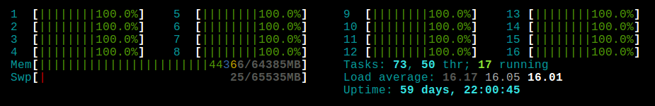

.. _faq-slurm:

.. role:: bash(code)
          :language: bash

.. role:: raw-html(raw)
          :format: html

What should be the CPU Load on my node?
=======================================
The CPU Load is the measure of the amount of computational work that a compute
node have been performing. It is always a good idea to keep monitoring this 
measure while we are computing, in order to know how well our job is running
and if it agree with the given parameters. 

To do this we are going to log into the compute node (or nodes) that where your
job is running on, then we are going to use htop_. For example, ``compute-0-0``:

.. code-block:: bash

   ssh compute-0-0
   htop

.. warning::

  You must have a running job on the compute node that you will log into, 
  otherwise, you will not be able to do it. In case you have an active session
  on a compute node and all your jobs finish their execution, Slurm is going to kill all
  user's remained process on that node, including your session.

On the htop_. screen you will find all the running process of that node.

The first thing you should check is if there's ``n`` number of running process plus
one (the htop process). 

Now, check the CPU load, htop display 3 different values: the Average of 1 minute,
5 minutes and 15 minutes. As a general rule, you should expect that the values 
will be the number of running cores that you asked in your sbatch script, in
most of cases is the same number of tasks ``n``.

In this example we run a job in :ref:`Cronos <about_cronos>` with 16 process.
Here is the sbatch parameters. 

.. code-block :: bash

   #SBATCH --ntasks=16
   #SBATCH --time=30:00

And here is the screen htop_ of the compute node that was running that job after
3 minutes.

.. image:: src/info/images/htop2.png

and here is the screen of htop_ on the same compute after 20 minutes.

As you can see, there is **17** running process and the load avarege is, close to
``16.00``. All the cores (``16``) were in used.

Do not mind if you find that your ``CPUs Load`` less than expected, that does
not necessary mean your job is not running in a correct way, it could be that
your application can not reach that CPU load, for examples, It does a lot of ``I/O``
processing.

.. warning::

  However, if you have a considerally high ``CPU Load`` (e.g 40.00, 50.00, 300.00) 
  this is not a good thing it will affect consireabily the performance of your job. Your are OVER LOADING 
  the node.  

In which cases should I use ``srun``?
=====================================
There are three different ways in which jobs may run by users in Slurm, using: 
``srun``, ``salloc`` and ``sbatch``. 

``srun`` is used to create an interactive job, this means the job is going to
be linked with the current ``tty`` and ``session`` of the user. If you disconnect it,
you will lose control over the job, or it might be killed. In case the resources that
you specified are not available, you will need to wait, keeping the session alive.
The ``std_out`` and ``std_err`` will be written in your terminal. 

``salloc`` is used to create jobs in allocated mode, the user is able to allocate
resources and, if available, interactively run jobs steps under that allocation
using a sub-shell created by Slurm. For further information see ``man salloc``.

``sbatch`` is used to submit a job for later execution using a script. We have
documentation about in the :ref:`submit <submit>` section. 

When you use ``srun`` inside a ``sbatch`` script, ``srun`` takes all the 
parameters given to that script and once the need resources of your job are available and
your job is ready to start running, ``srun`` will communicate to the Slurm compute node 
daemons to launch the ``ntasks`` of your job as it was specified. 

In conclusion, as a **short answer**, you **need** to use ``srun`` inside your sbatch scripts
when your job uses more than **one** ``ntask`` in order to allow Slurm to distribute these
tasks in the cluster. Otherwise, the number of ``ntasks`` won't take effect and
the job will be serial. Thus, should use ``srun`` inside your MPI and Array
jobs, in the :ref:`submit <submit>` section we have some examples of these cases.  

What is the difference between ``N``, ``n`` and ``c``?
======================================================
``N`` refers to the number of **Nodes**. Nodes, can compute one or more 
**tasks** (``n``), ideally a **node** can compute up to its number of cores at the same time, also
depending on the specific application. Each task has one or more  **threads** (``c``).
We recommend to specify ``n`` tasks rather than ``N`` nodes, you should let 
Slurm decides how many machines your job needs. 

Here_ is a good explanation about the difference between Process and Threads.

image like http://www.maisondelasimulation.fr/smilei/_images/NodeWith2Processes.png 

.. _Here: https://www.backblaze.com/blog/whats-the-diff-programs-processes-and-threads/
.. _htop: https://hisham.hm/htop/