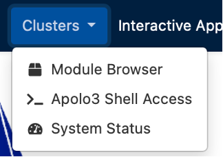
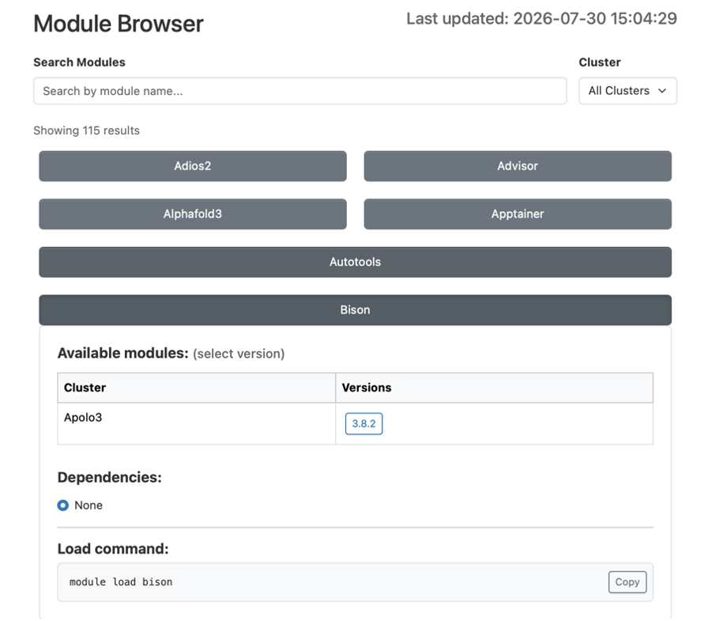
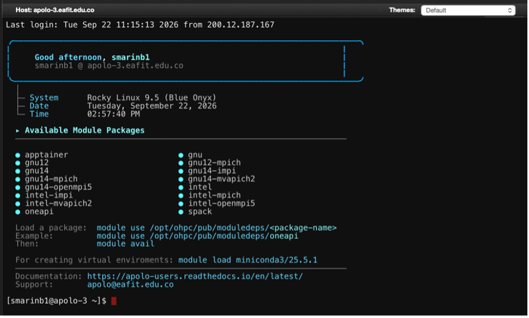
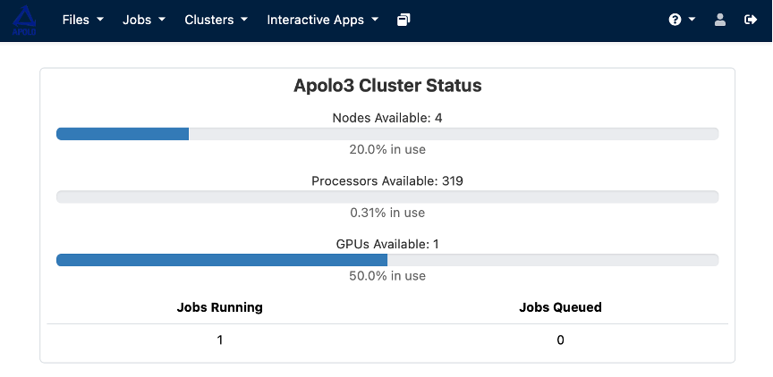

Clusters
--------

The "Clusters" tab has 3 options in its drop-down menu.

Module Browser
~~~~~~~~~~~~~~

This section contains the information of all the modules available in Apolo 3, users can search up modules by their name and consult the information of each one by tapping on their name.

Apolo3 shell access
~~~~~~~~~~~~~~~~~~~

Once the user chooses this option they will be redirected to a sign in screen and right after that to an online terminal as the following:

System status
~~~~~~~~~~~~~

This option shows you the cluster's status, such as the number of nodes, processors, and GPUs available, as well as jobs that are running and in the queue.

