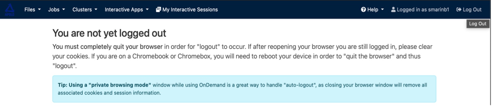

Considerations
--------------

The remaining tabs, such as "Interactive Apps," are not detailed here because they will be of little use to most users. If you find that you need one of these for your project, we suggest you do your own research; if you have any further questions, please contact the center.

The logout process has an additional step than normal: in addition to clicking the logout icon, you must completely close the tab. However, it is recommended that you use incognito mode to ensure that the logout is effective if you want to log out permanently; otherwise, the session will likely remain open in the browser.

If there are any further questions we are happy to help you out, please send us all your questions to our email address, and we'll get back to you shortly: apolo@eafit.edu.co