Jobs
----

Next to the previous section we find "Jobs", with three main sections, although the last one won't be explained since is not open:

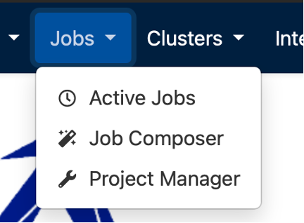

Active Jobs
~~~~~~~~~~~

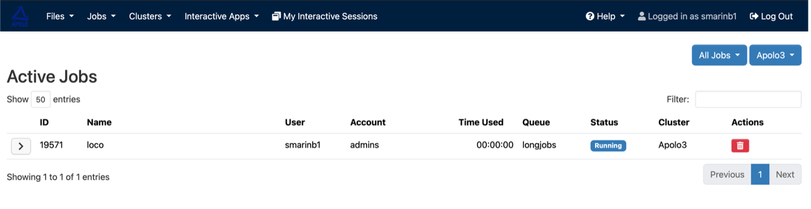

This panel lets you view all active jobs on the nodes, and in the upper-right corner, you can choose between "All jobs" or "Your jobs" using the blue button next to 'Apolo3' button.

Each job has an ID, name, user, the account or group to which it belongs, the time it has been running, the partition where it is running or waiting, the job status, and the cluster.

.. note::
   Due to communication and monitoring with the cluster, the OpenOnDemand page has a 2-minute delay in the reported time and you must reload the page manually to see it; however, once the job is finished, the reported time is accurate.

Finally, there is a small red button that, when clicked, allows you to automatically cancel the job. Note that whether you've canceled a job, or it has executed successfully, you will see that the Status is the same: "Completed", as you can see in the images below:

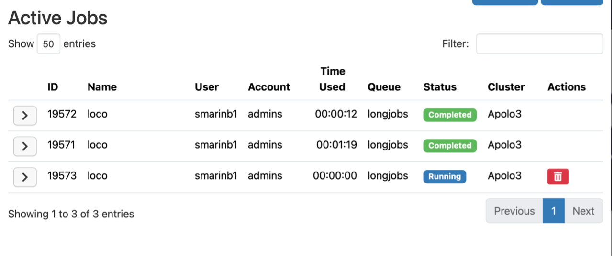

Please note that a few minutes after the job has finished or been canceled, the entry will no longer appear here, as it will no longer be an "active job."

Job Composer
~~~~~~~~~~~~

This section allows you to create and manage all your job templates. This panel is less intuitive and a little more complicated, therefore, once you enter for the first time a step-by-step tutorial will guide you through the interface.

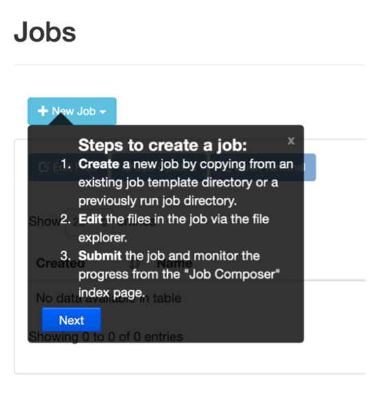

Here we will explore some of the most useful functionalities and how to use them. The first important change is to understand how on Open OnDemand we separate our job scripts from the rest of the scripts in our home, therefore, is not possible to take a job that is in your home as a .sh script and immediately submit it. You can only Submit a job that is in the Job composer section.

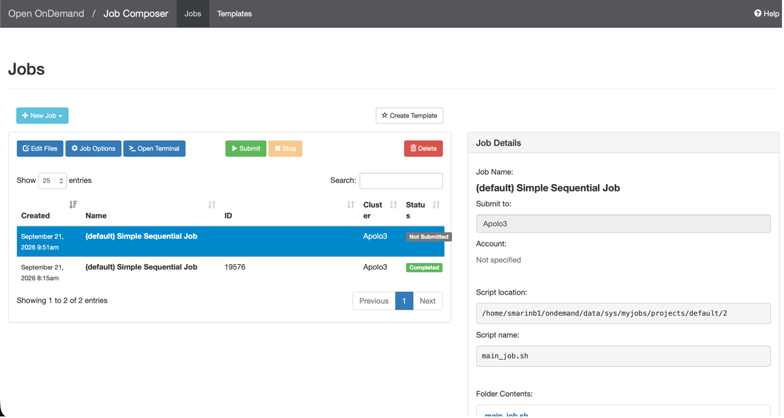

As you can notice in the image there are 2 main panels: The one that allows you to manage everything and the one that displays the "Job details" at the right side. To create a job, you'll enter all the instructions on the left side and watch it take shape on the right side. Once you start adding content to the job, you'll type directly into the right panel.

To create a job
^^^^^^^^^^^^^^^

You can either chose to do it from "Default Template" or "Selected job"; we discourage you to use "From specified path" since its a less direct and complicated way of creating a job.

**Default template:**
It will immediately generate a job from a template created by the apolo admin users to help you set everything up. The Cluster you will submit to is already set, as well as the script location, the script name and the folder contents, you cannot modify this directly on the job (to see how to do it go to the section below "Job options"), however, the script content is yours to customize:

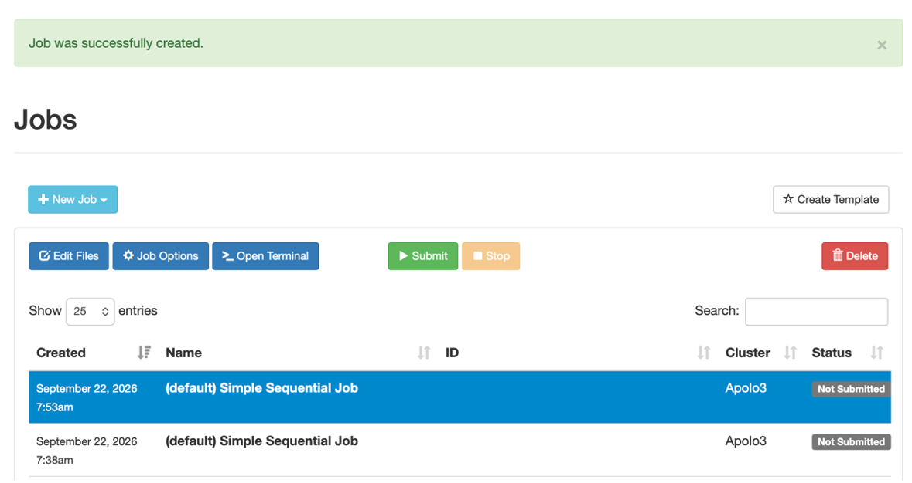

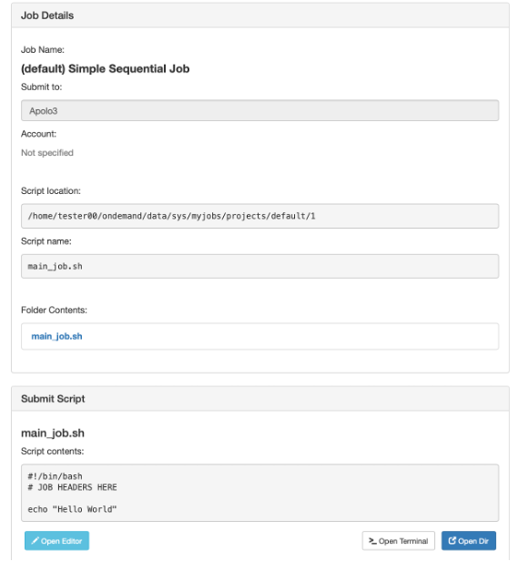

To personalize your script you must select "Open editor" or "Open terminal" in case you want to do it directly in your terminal using ``nano`` or ``vim``. "Open dir" button allows you to go to the directory that holds all your jobs.

**Selected job:**
Before selecting this option make sure the job we want to "duplicate" or whose structure you need to copy is selected in blue, since this option will duplicate a selected job. For example: I want to duplicate an existing job since i want to change some parameters but keep the original version, I must make sure said job is selected and then choose to create it from this option, as you can see in the following image:

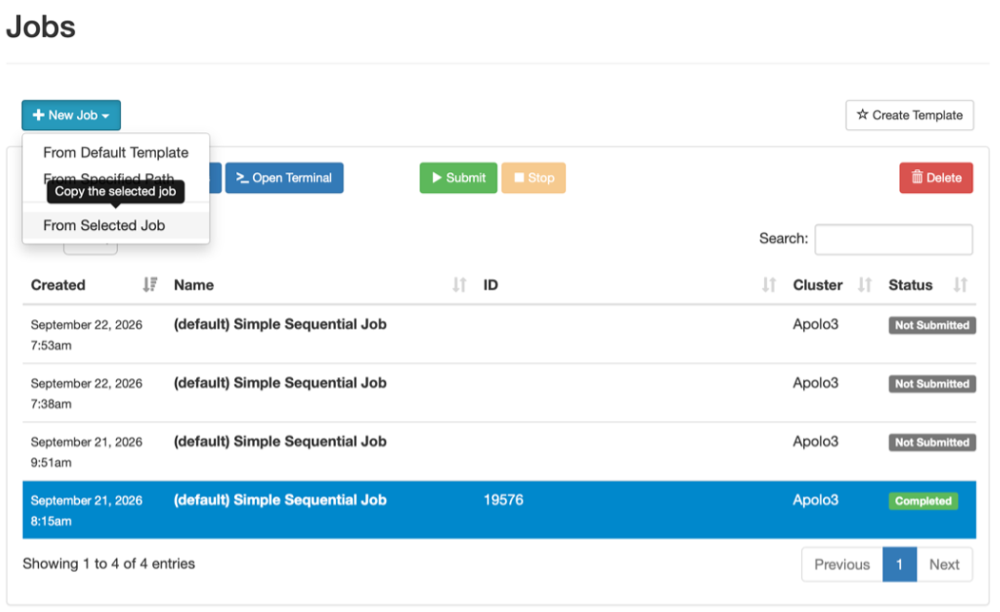

.. note::
   If you don't want to do the process explained above you can open an active terminal from the web page (explained below in the "Cluster" section), and submit the job as you normally do - with the ``sbatch`` command.

To edit files
^^^^^^^^^^^^^

The button right below "New Job" is "Edit files", this option opens up the directory with your job and the .out and .err scripts from the submitted job. There you can navigate and edit them freely. Notice that you have to select a job to be able to choose this option, since it opens up the directory of this specific job, but from there you can open the rest:

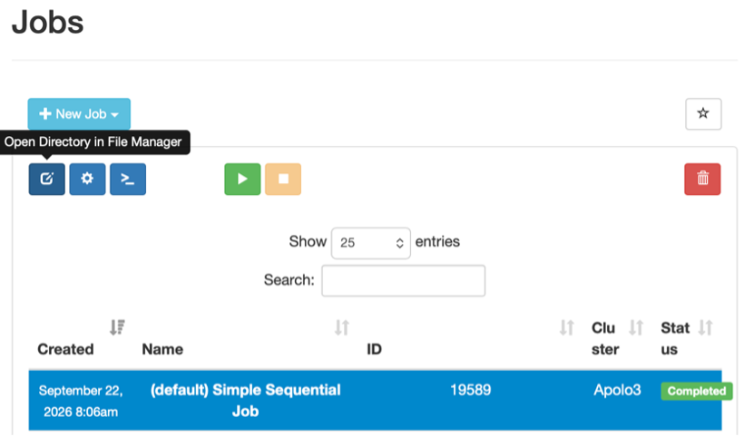

Once you press the button the page you will see is the following:

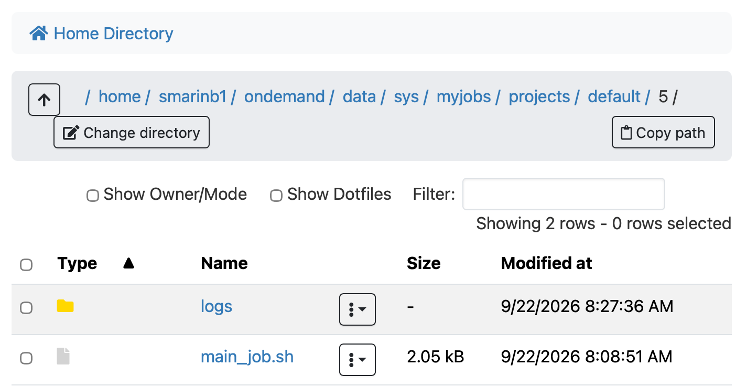

`main_job.sh` is the generic name for your job script and the logs directory has all the .err and .out of this submitted job, if you submit this job more than once all the logs will be in this same directory:

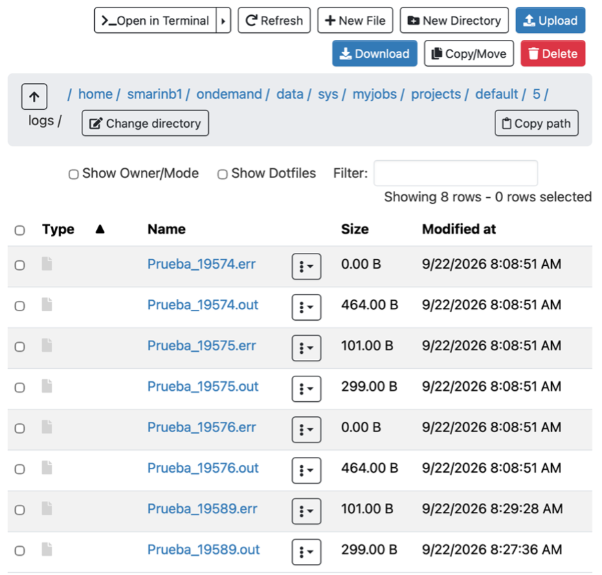

Here you can do a lot of things with each file (always having it selected), with the buttons at the top of the screen: like open the terminal and check them out directly there, refresh this screen, create a new file or directory, upload or download a file from or to your computer, copy or move a file from this path to another or delete a file. We encourage you to explore the rest of the functionalities this page have.

You can also go to all the projects changing the path to "default", but there all the projects are separated in numbered, nor labeled, folders, which makes it harder to recognized them if you don't open them up directly from the job composer panel.

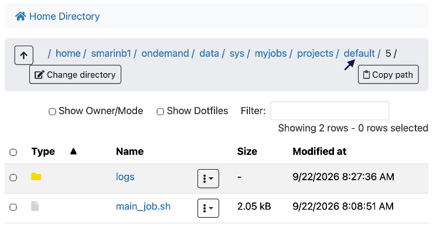

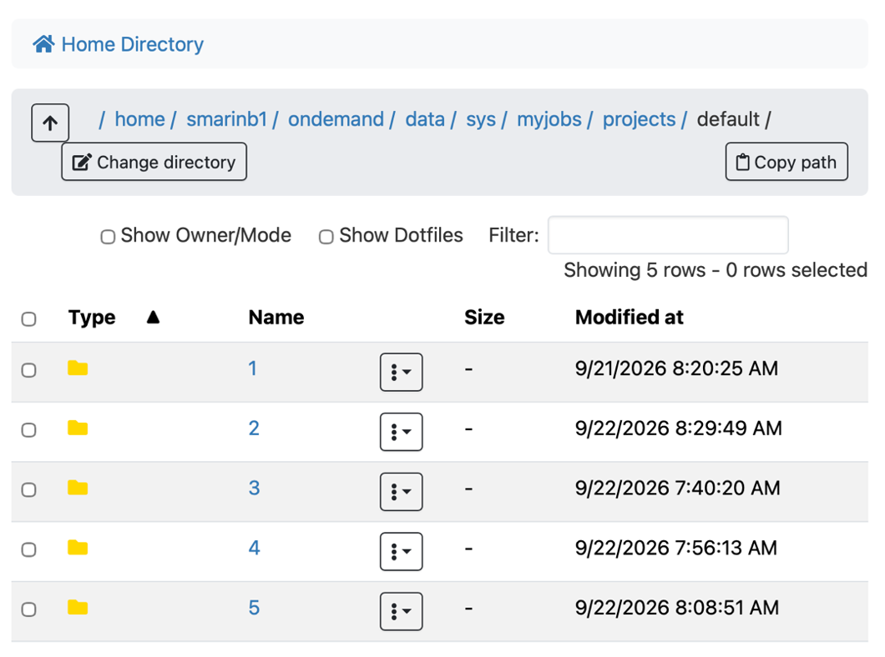

Edit job parameters
^^^^^^^^^^^^^^^^^^^

This option will allow you to modify and set the parameters that you cannot modify when you create a job, but this parameters apply to all jobs, not only for one.

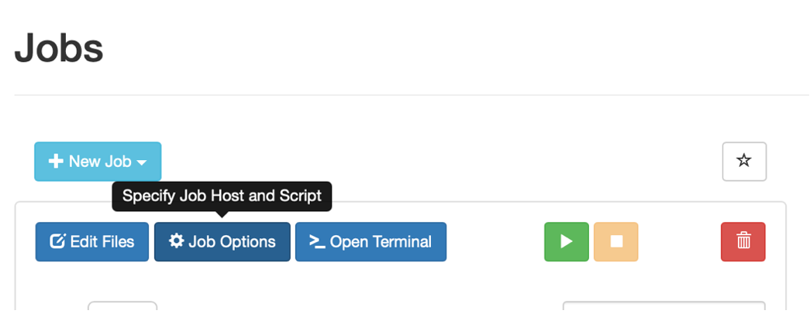

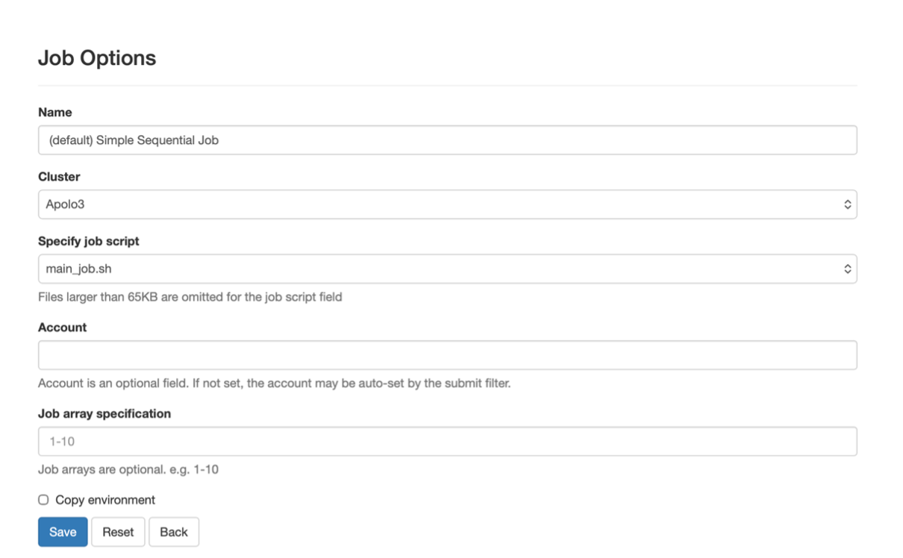

* **Name:** The name that appears when you create a job in the "name" section.
* **Cluster:** is always set to Apolo3, there is no other cluster available.
* **Specify job script:** you cannot change this parameter, is the name of the job script in the folder, the name that appears in "active jobs" is the one that you choose in the content of the job script, not this one, this is just the name of the .sh script on the directory.
* **Account:** optional parameter since it must always be your account and it is automatically detected.
* **Job array specification:** it allows you to submit and manage a batch of multiple similar jobs (an array) under a single job ID by defining indices or ranges (e.g., 0-9). It sets the environment variable SLURM_ARRAY_TASK_ID for each sub-job, enabling them to process different data inputs concurrently.

We suggest you to leave this parameters as the default ones, but if you feel like customizing them, we encourage you to investigate a little deeper each field.

Submitting a job
^^^^^^^^^^^^^^^^

This is an easy step, you should select a job an press the green button "Submit", you will see the Status change immediately to "Running". After that you can check on the "Active job" panel the progress and the updates. You can come back here at the "job composer" to go the directory of the job and check the .err and .out.

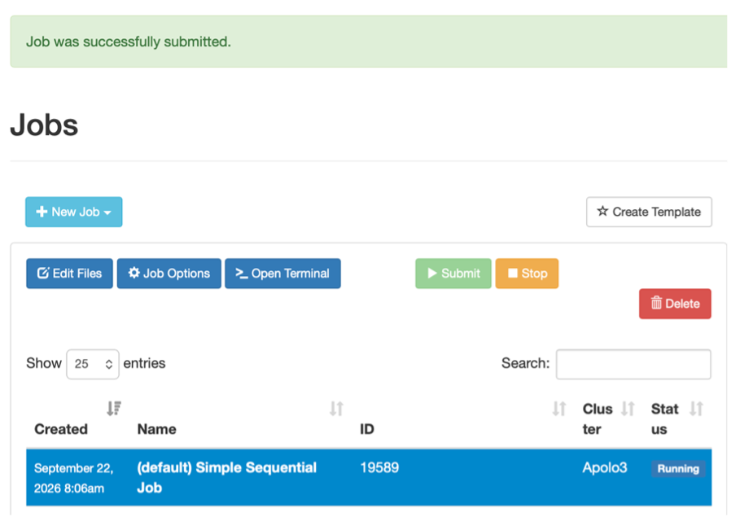

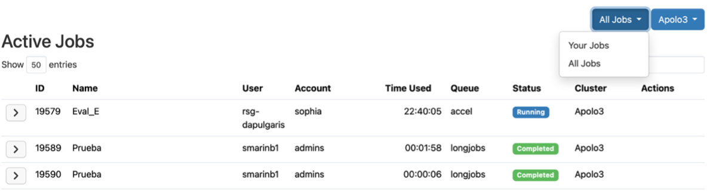

Right next to the "Submit" button you have the "Stop" button, which works exactly like the other one just that it cancels the job, which you can notice when the status changes to "Failed" and to "completed" in the "Active jobs" panel.

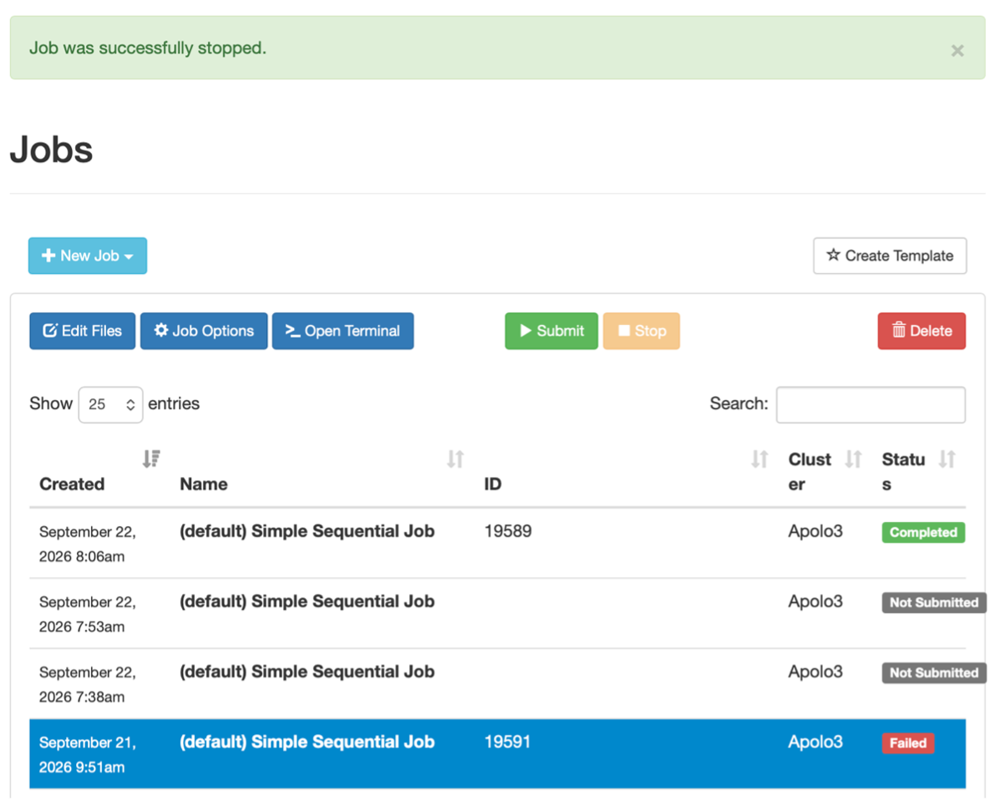

Open a terminal
^^^^^^^^^^^^^^^

If you feel more comfortable editing your job on a terminal, you can also selected an choose the button "Open terminal" in order to immediately open the folder of the selected job on the terminal, so you can navigate and open all the files there:

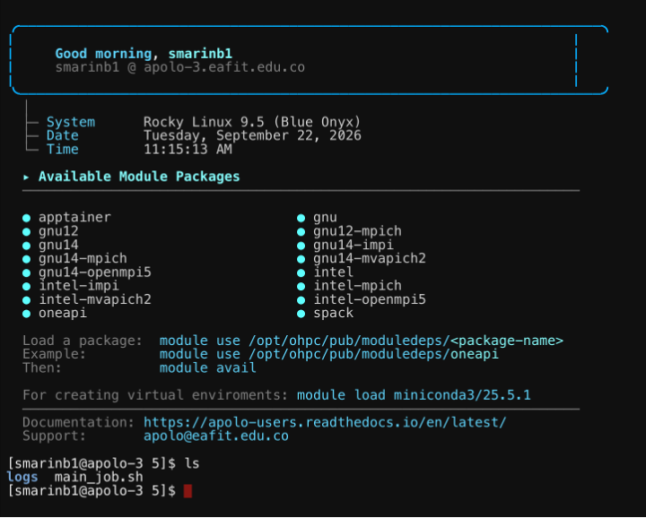

Delete a job
^^^^^^^^^^^^

In order to delete a job you must have the job selected and then pressed the "Delete" button at the top right corner of the section and after confirm it the job will be deleted:

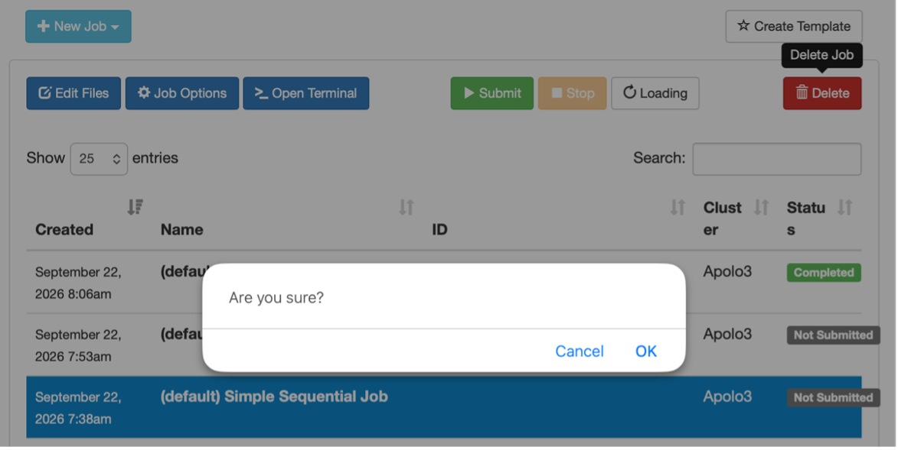