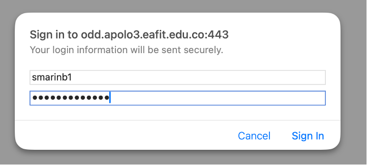
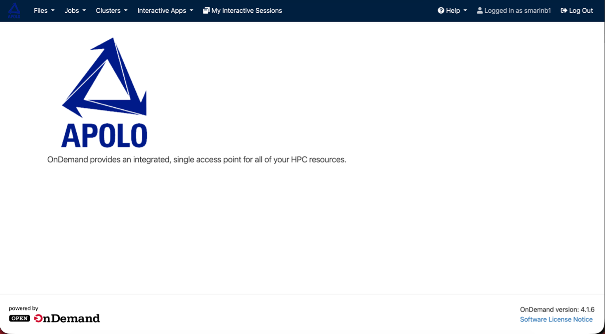

Log in
------

Open OnDemand is Apolo's official web portal for accessing resources on the Apolo 3 Cluster in a graphical, direct manner without having to use the terminal. This web platform allows you to:

* Manage your personal files and research folders
* Launch computational jobs and monitor their status in real time
* Open SSH-connected terminals from your browser without having to log in

Logging in is simple and straightforward, just like on any other website:

1. Open your preferred web browser (Google Chrome, Firefox, or Edge are recommended), preferably in incognito mode, for an easier log out.
2. Go to the following URL: `odd.apolo3.eafit.edu.co <https://odd.apolo3.eafit.edu.co>`_
3. Log in using the same institutional credentials you used to log in via a terminal. For the username, just enter the part before the @, and the password is exactly the same.

Once you're in, you'll see the main screen, where you'll find the Apolo logo and a brief description of Open OnDemand:

