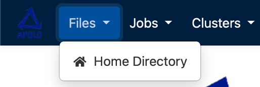

How to navigate on the platform
-------------------------------

The main way to switch between tabs and access all features will be the navigation bar at the top, which is shown in dark blue in the image above. The items on this bar are:

The Apollo logo on the far left always takes you back to the main screen.