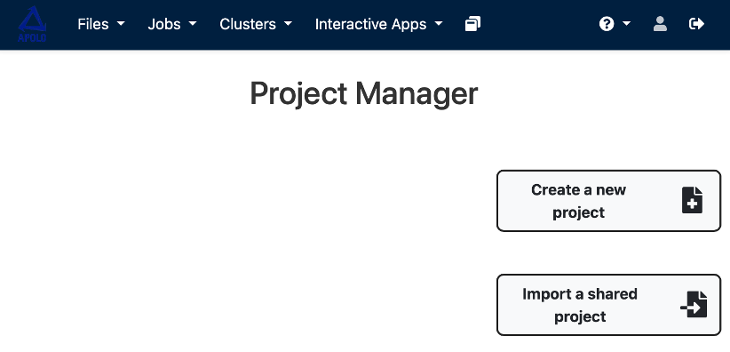
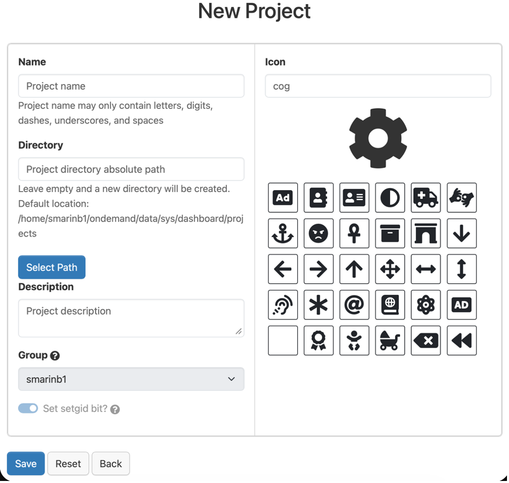
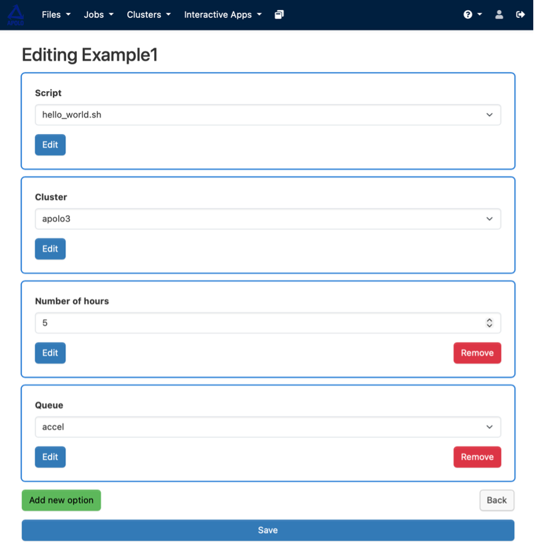
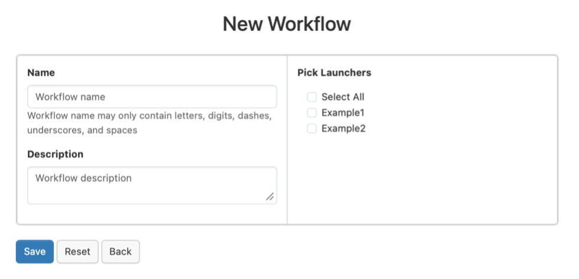
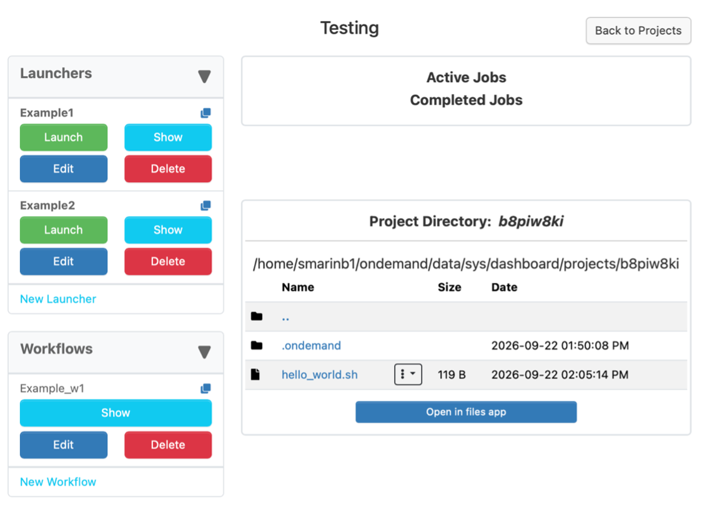

Project Manager
---------------

This section allows you to create, organize, and manage your computational projects. A new feature in version 4.1, the Project Manager provides a suite of tools to leverage the Open OnDemand features from batch connect apps for each user's own personal scripts, track and organize their job history, assemble individual jobs into large-scale workflows, and easily share and collaborate on these projects with their team.

The basic element of a project is the launcher, which is a paired form and script that can submit jobs to the scheduler. By selecting different options in the form, a user can change both scheduler parameters (account, resources, etc.), or change the behavior of the script itself through environment variables.

All of the scripts, input data, and output data for a project's launchers are stored in the project directory. This directory can be freely organized according to individual needs, allowing users to customize for anything from large one-time jobs to long-term projects with jobs that are repeated many times.

To create a project
~~~~~~~~~~~~~~~~~~~

You can either choose to do it from "Create new Project" or "Import a shared project"; we encourage you to use "New Project" if you want to start from scratch or use a template.

In case you feel you might need to use shared project option we count on your own research to cover its functionalities, because they won't be covered here.

We begin by opening the Project Manager, the third item under the 'Jobs' tab in the navigation bar. From the Project Manager, we select the 'Create a new project' button on the upper right.

Since this will be a personal project, we only need to provide a name and icon for the new project, and press 'Save'.

Project Details:
* **Name:** The name that appears when you create a project in the "name" section.
* **Description:** A brief description of your project.
* **Script location:** The path to the directory where your project files are stored.
* **Icon:** an icon that helps you recognize your project.

To add your scripts
~~~~~~~~~~~~~~~~~~~

To add our existing scripts into the project, we first click on the 'Open in files app' button below the project directory. This takes us to the file browser, where there is a button to upload from our machine.

After uploading the scripts, we can return to the project dashboard and see the file structure in the project directory. Before continuing, you should make sure that the files in the scripts/ directory are all executable, so they can be called directly from your controller script. The main script we want to submit does not need to be executable to be submitted to the scheduler.

To add a launcher
~~~~~~~~~~~~~~~~~

To submit these scripts to the scheduler, we start by clicking the 'New Launcher' button on the left side of the project dashboard, as pictured in the image above. We will give this launcher a name, and press 'Save'.

After saving the launcher, it will appear in the list of launchers on the left side of the dashboard. We can customize the form for the launcher by pressing the 'Edit' button on the launcher card, some of the customizable fields are:

.. note::
   All launchers are required to have a cluster and a script selection in their form by default. These fields cannot be removed by editing the launcher, as any launcher without these fields will be rejected by the scheduler.

Managing Launchers
~~~~~~~~~~~~~~~~~~

Each launcher card provides several action buttons:

* **Launch:** Submits the job to the scheduler using the launcher's form and script.
* **View:** Opens a read-only view of the launcher's form and configuration.
* **Edit:** Opens the form editor to customize scheduler parameters or environment variables.
* **Job Info:** Displays the status and details of jobs submitted through this launcher.

The Project Manager uses an automated poller that checks each launcher's status (queued, running, failed, completed) at 30-second intervals and intuitively represents it in the UI using color coding.

Creating Workflows
~~~~~~~~~~~~~~~~~~

Workflows allow users to connect their launchers together with dependency relationships, enabling them to build self-contained systems that can be run with a single click. These systems can be as simple or intricate as needed, and are easily assembled through an intuitive graphical interface.

To create a workflow, you connect launchers by defining which launcher must complete before the next one begins. The Project Manager supports composite job workflows, allowing users to organize, construct, and execute multiple batch jobs all through the same interface.

Submitting a job
~~~~~~~~~~~~~~~~

This is an easy step: you should select a launcher and press the "Launch" button. You will see the Status change immediately to "Running" or "Queued". After that, you can check on the "Active Jobs" panel the progress and the updates. You can come back here at the Project Manager to go to the directory of the job and check the .err and .out files.